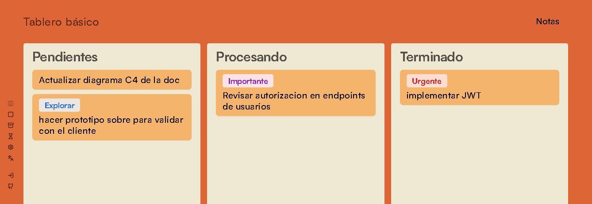

<div align="center">



# Capo

**Un tablero personal para organizar tu semana de trabajo sin distracciones.**

[](https://cm-boar.netlify.app/)
[](https://github.com/CiroMirkin/Capo/actions/workflows/playwright.yml)
[](https://github.com/CiroMirkin/Capo/actions/workflows/release.yml)
[](https://github.com/CiroMirkin/Capo/stargazers)
[](LICENSE)

</div>

Capo reúne en una sola interfaz tres cosas que normalmente viven en apps separadas:
el **tablero** de tareas, la **nota de contexto** de cada tablero y la **auditoría
de tiempo** (registro de uso + archivo histórico). Está pensado para una sola
persona —no para equipos— que gestiona su propio trabajo en entornos de alta carga
mental.

> [!NOTE]
> Capo funciona **con o sin cuenta, y sin cuenta funciona entero**. Sin sesión,
> toda la persistencia cae en el `localStorage` del navegador y no se pierde
> ninguna funcionalidad central. Con sesión, los datos persisten en PostgreSQL y
> se habilitan hasta 5 tableros independientes.

## Características

- **Tablero flexible** — vistas en lista, en columnas, o en lista con la nota al lado.
- **Tareas priorizadas** — grupos de etiquetas con prioridad, fecha límite opcional
  con aviso de vencimiento, nota por tarea y movimiento entre columnas.
- **Recordatorios** — se muestran cada vez que una tarea entra en la columna que elijas.
- **Nota de tablero** — una nota larga (hasta 10 000 caracteres) por tablero,
  archivable con historial fechado.
- **Archivo de tareas** — archivo diario con retención de 60 días, línea de tiempo
  de cada cambio de estado y exportación a **PDF o JSON**.
- **Registro de uso** — tiempo de trabajo dividido en sesiones, en `HH:MM:SS`, se
  pausa al cerrar la pestaña.
- **Bilingüe** — toda la UI en español e inglés, según el idioma del sistema operativo.
- **Temas claro / oscuro / sistema** — interfaz sobria para reducir la fatiga visual.

## Demo

Vista previa en vivo: **[cappo.vercel.app](https://cappo.vercel.app/)** — corre
en modo invitado, sin registro.

## Stack

| Área | Tecnología |
|------|------------|
| Framework | Next.js 15 (App Router), React 18, TypeScript |
| Base de datos | PostgreSQL + Prisma 7 (`@prisma/adapter-pg`) |
| Auth | [Better Auth](https://better-auth.com) — email + contraseña (bcrypt) o GitHub OAuth, sesión en DB |
| Estado | TanStack Query (servidor) · Zustand (cliente, puntual) |
| UI | Tailwind CSS · Radix UI · lucide-react · Tiptap (rich text) · Motion |
| i18n | i18next / react-i18next (ES · EN) |
| Tests | Vitest (unitarios) · Playwright (e2e: Chromium + Firefox) |
| Release | semantic-release (conventional commits en español) |

## Puesta en marcha

La app vive en `web-app/`; todos los comandos se corren desde ahí.

### Requisitos

- **Node 24** y npm — fijado en `web-app/.nvmrc` (con nvm: `nvm use 24`).
- Una base de datos **PostgreSQL**. Lo más rápido es
  [Prisma Postgres](https://console.prisma.io) (plan gratuito: crear DB → copiar la
  connection string). Solo hace falta para el modo con cuenta.

### 1. Instalación

```bash
git clone https://github.com/CiroMirkin/Capo.git
cd Capo/web-app
nvm use 24
npm install
```

`npm install` instala también los git hooks de Husky: lint + formato antes de cada
commit, tests antes de cada push.

### 2. Variables de entorno

```bash
cp .env.example .env
```

| Variable | Qué poner |
|----------|-----------|
| `DATABASE_URL` | Connection string de tu Postgres. |
| `AUTH_SECRET` | `openssl rand -base64 32`. |
| `BETTER_AUTH_URL` / `NEXT_PUBLIC_APP_URL` | `http://localhost:3000` en local (sin barra final). |
| `AUTH_GITHUB_ID` / `AUTH_GITHUB_SECRET` | Solo para login con GitHub: [OAuth App](https://github.com/settings/developers) con callback `http://localhost:3000/api/auth/callback/github`. Si no, dejá los placeholders y usá email + contraseña. |

### 3. Base de datos

```bash
npx prisma generate        # genera el client (no toca la DB)
npx prisma migrate deploy  # aplica las migraciones
npm run seed               # catálogo de temas + grupos de etiquetas (Eisenhower, Dev)
```

> [!TIP]
> Si vas a **modificar** el schema, usá `npx prisma migrate dev --name <nombre>` en
> lugar de `deploy`.

### 4. Levantar la app

```bash
npm run dev
```

→ <http://localhost:3000>

## Comandos

Todos desde `web-app/`.

| Comando | Qué hace |
|---------|----------|
| `npm run dev` | Servidor de desarrollo |
| `npm run build` · `npm run start` | Build de producción y servirlo |
| `npm run lint` · `npm run format` | ESLint / Prettier |
| `npm test` | Tests unitarios (Vitest) |
| `npm run test:e2e` | Tests e2e (Playwright, Chromium + Firefox) |
| `npm run test:all` | Unitarios + e2e |
| `npx prisma studio` | Explorar y editar la base de datos |

> [!NOTE]
> Playwright necesita descargar los navegadores una vez: `npx playwright install chromium firefox`.

## Estructura del repo

```
.
├── web-app/            App Next.js (código, config, tests)
│   ├── app/            Rutas (App Router)
│   ├── src/
│   │   ├── features/   Una carpeta por feature, autocontenida
│   │   └── shared/     Design system, i18n, libs, preferencias
│   ├── prisma/         Schema y migraciones
│   └── e2e/            Tests Playwright
└── docs/               Documentación y diagramas C4
```

Cada `src/features/<feature>/` sigue la misma forma (`api/`, `hooks/`, `model/`,
`ui/`, `useCase/`, `state/`). El patrón central es el **repositorio dual**: el mismo
hook habla con server actions + Prisma si hay sesión, o con `localStorage` si no la
hay. Detalle en [`docs/arquitectura.md`](docs/arquitectura.md).

## Límites de diseño

Son deliberados: los límites duros previenen la sobrecarga cognitiva.

| Recurso | Límite |
|---------|--------|
| Tableros por usuario | 5 |
| Columnas por tablero | 2–6 |
| Tareas por columna | 10 |
| Descripción de tarea | 200 caracteres |
| Nota por tarea | 5 000 caracteres |
| Nota de tablero | 1 por tablero · 10 000 caracteres |
| Archivo de tareas | 30/día · retención 60 días |
| Notas archivadas | 30 (FIFO) |

## Seguridad

> [!IMPORTANT]
> El acceso a los datos se valida en el servidor. Cada server action exige una
> sesión válida y comprueba que el tablero, la columna o la tarea pertenezcan al
> usuario autenticado antes de leer o escribir
> (`web-app/src/shared/lib/serverAuth.ts`). Ninguna cuenta puede acceder a datos de otra.

## Documentación

| Documento | Contenido |
|-----------|-----------|
| [`docs/set-up.md`](docs/set-up.md) | Puesta en marcha paso a paso |
| [`docs/arquitectura.md`](docs/arquitectura.md) | Modelo C4, anatomía de una feature, rutas |
| [`docs/modelo-datos.md`](docs/modelo-datos.md) | Schema Prisma y diagrama ER |
| [`docs/casos-de-uso.md`](docs/casos-de-uso.md) | Historias de usuario implementadas, con sus límites |
| [`docs/comandos.md`](docs/comandos.md) | Comandos del día a día |
| [`docs/features/`](docs/features/) | Doc por feature con lógica propia |
| [`docs/e2e.md`](docs/e2e.md) | Cómo están armados los tests end to end |
