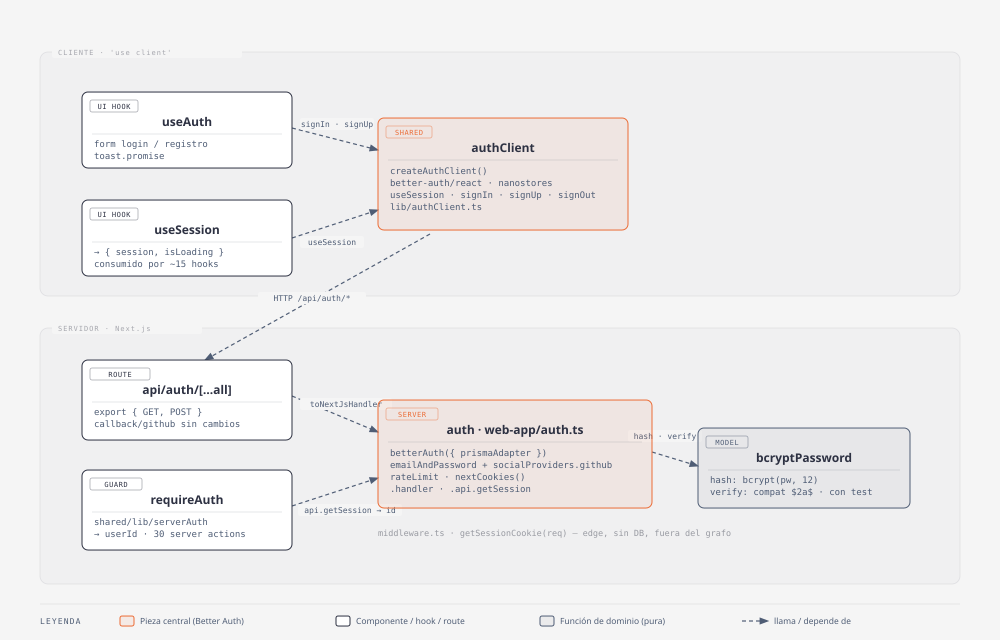

# Autenticación

## Resumen

Login con **GitHub OAuth** o **email + contraseña**. La app funciona sin
sesión (modo invitado sobre el guest board); la sesión sólo habilita los
tableros propios, persistidos en la DB. Corre sobre [Better Auth](https://better-auth.com)
(`prismaAdapter`, sesión en tabla `Session`). La UI de login es una sola tarjeta
que alterna entre "entrar" y "registrarse".

- **Código:** `web-app/src/features/auth/` (+ `web-app/auth.ts`,
  `web-app/middleware.ts`, `web-app/app/api/auth/[...all]/route.ts`,
  `src/shared/lib/serverAuth.ts`).
- **Alcance:** entrar / registrarse / salir; eliminar cuenta y todos los datos
  asociados; guard de sesión en server actions; redirección por sesión entre
  `/`, `/auth` y `/dashboard` (ver [[inicio-invitado-dashboard]] para el resto
  del ruteo — `/home` y `/guest` son siempre públicas, sin guard).
- **Fuera de alcance:** verificación de email, reset de contraseña, 2FA,
  organizaciones (nada de eso está habilitado en `auth.ts`).

## Diagrama C4 — código

Fuente editable: `docs/diagramas/autenticacion-c4.html` (skill `diagram-design`,
tipo "UML class"). Fuera del diagrama por presupuesto: `AuthForm` /
`OAuthProviders` (presentacionales, sin lógica) y los ~15 hooks de query
que sólo leen `useSession()` del barrel. También `deleteAccount` /
`DeleteAccountSection`: `deleteAccount` es un caller más de `requireAuth`
(ya representado por el conteo "~30 server actions" de esa caja) sin lógica
propia, y `DeleteAccountSection` es presentacional igual que `AuthForm`.

### `auth` — `web-app/auth.ts`

Instancia única de Better Auth (server). Define los dos flujos (email/password
y GitHub), el override de hashing a bcrypt y el rate limit. La consumen el route
handler y `serverAuth.ts`.

### `authClient` — `src/features/auth/lib/authClient.ts`

Cliente de Better Auth (`better-auth/react`, nanostores). Expone `useSession`,
`signIn`, `signUp`, `signOut`. No necesita provider React.

### `useSession` — `src/features/auth/hooks/useSession.tsx`

Envuelve `authClient.useSession()` y lo normaliza a `{ session, isLoading,
update }` con `session: SessionType | null`. Es la API que consume todo el resto
de la app vía el barrel `@/features/auth`.

### `requireAuth` — `src/shared/lib/serverAuth.ts`

`auth.api.getSession({ headers })` → devuelve `userId` o tira `'No autorizado'`.
Lo usan `requireBoardAccess` / `requireColumnAccess` / `requireTaskAccess`, y a
través de ellos las ~30 server actions de tableros.

### `middleware` — `web-app/middleware.ts`

Chequeo optimista de cookie con `getSessionCookie` (edge, sin DB): con cookie,
`/` y `/auth` redirigen a `/dashboard`; sin cookie, `/dashboard` redirige a
`/`. `/home` y `/guest` no pasan por acá, son siempre públicas. La validación
real la hacen los server guards.

## Modelo / lógica

No hay funciones puras de dominio propias más allá de `bcryptPassword`
(`lib/bcryptPassword.ts`, test `lib/bcryptPassword.test.ts`):

- `bcryptPassword.hash(password)` → `bcrypt.hash(password, 12)`.
- `bcryptPassword.verify({ hash, password })` → `bcrypt.compare(password, hash)`.
- Se pasa como `emailAndPassword.password` en `auth.ts`. Por defecto Better Auth
  usa scrypt; el override mantiene bcrypt para que los hashes `$2a$` ya
  guardados en la DB sigan validando sin reset. Es el punto más frágil de la
  migración → tiene test.

Reglas de negocio delegadas a Better Auth: validación de email, largo mínimo de
contraseña (`minPasswordLength: 6`), rate limit (`window: 60`, `max: 10`),
unicidad de email (`Account`/`User`), timing-safe en el login.

`useAuth` (`hooks/useAuth.tsx`) orquesta el form: registro →
`authClient.signUp.email` (auto-login), login → `signIn.email`, GitHub →
`signIn.social`. Cada llamada devuelve `{ data, error }`; el hook tira
`error.message` y lo muestra con `toast.promise`.

`deleteAccount` (`api/actions/deleteAccount.ts`) no tiene lógica propia:
`requireAuth()` + `prisma.user.delete({ where: { id: userId } })`. Todo el
borrado en cascada ya está resuelto en el schema (ver Persistencia y modelo),
así que no hace falta limpiar tablas a mano ni el plugin `deleteUser` de
Better Auth. La UI (`ui/DeleteAccountSection.tsx`) reusa
`DestructiveSection` (`shared/ui/organisms/DestructiveSection.tsx`, doble
confirmación: email exacto + click en un toast) y, tras borrar, cierra sesión del lado cliente
(`authClient.signOut()`) antes de redirigir a `/` — el orden importa, porque
la server action necesita la cookie de sesión todavía válida.

## Persistencia y modelo

- **Tipo TS:** `SessionType = { user: SessionUser; expires: string } | null`
  y `SessionUser = { id; email?; name?; image? }` en `contexts/SessionProvider.tsx`.
- **Prisma:** modelos `User`, `Account`, `Session`, `Verification` en formato
  Better Auth (ver `schema.prisma`). Cambios respecto de Auth.js:
  - `User`: `+ emailVerified`, `+ updatedAt`, `name` pasa a no-null, `- password`
    (se mueve a `Account.password`).
  - `Account`: renombres (`provider → providerId`, `providerAccountId →
accountId`, `access_token → accessToken`, etc.), `+ password` (hash bcrypt
    para `providerId = 'credential'`), `+ createdAt/updatedAt`,
    `- type/token_type/session_state`. Unique `(providerId, accountId)`.
  - `Session`: `sessionToken → token`, `expires → expiresAt`,
    `+ createdAt/updatedAt/ipAddress/userAgent`.
  - `VerificationToken → Verification` (`+ id` como PK, `token → value`,
    `expires → expiresAt`, `+ createdAt/updatedAt`).
- **Migración:** `prisma/migrations/20260910143000_better_auth/migration.sql`,
  escrita a mano (renames + `INSERT` de credenciales) para preservar la cuenta
  GitHub y los hashes existentes. **La corre el usuario** (`prisma migrate
deploy`) — el agente no toca la base. Las sesiones pasan de JWT a DB: todos
  se re-loguean una vez.
- **Modo invitado:** sin cambios — el guest board vive en `localStorage`, nunca
  toca `auth`.
- **Borrado de cuenta:** `prisma.user.delete()` dispara la cascada ya
  declarada en `schema.prisma`: `User` → `Account`/`Session`/`Board`
  (Cascade) y desde `Board` en cascada `Column`→`Task`, `Note`, `Reminder`,
  `Archive`, `Limbo`, `TagGroup`; y `Theme.userId` (temas propios). No hay
  schema nuevo, solo se ejercita el que ya existía.

## i18next

La feature reusa las existentes: `sing_in`, `sing_in_toast`,
`successful_log_in_toast`, `log_in_form_title`, `already_have_an_account`,
`dont_have_an_account`, `or_continue_with`, `continue_with_github`, `log_out`,
`successful_log_out_toast`, `log_out_error`, `auth_error`, `loading`.

Claves nuevas (borrado de cuenta), en `settings.dashboard.*`:
`delete_account_section_title`, `delete_account_section_description`,
`delete_account_email_input_label`, `delete_account_email_input_placeholder`,
`delete_account_button`, `delete_account_warning`, `delete_account_loading`,
`delete_account_success`, `delete_account_error`.

> Los mensajes de error de Better Auth (`error.message`) llegan en inglés y sin
> traducir. Si molesta, mapear los códigos de `authClient.$ERROR_CODES` en
> `useAuth`. Ver Tips.

## Tips / historia

- **2026-09-19 — Eliminar cuenta y todos los datos.** Se agregó
  `deleteAccount` + `DeleteAccountSection` en ajustes del dashboard. Decisión:
  el componente de doble confirmación (`DestructiveBoardSection`) vivía en
  `features/boards`, usado solo por `DeleteBoard`; al necesitarlo también
  para la cuenta se promovió a `shared/ui/organisms/DestructiveSection.tsx`
  (renombrado, sin nada específico de tableros) en vez de importarlo cruzado
  entre features o duplicarlo. `DeleteBoard` se actualizó para consumir la
  versión compartida. También se decidió no habilitar el plugin `deleteUser`
  de Better Auth: como todo vive en el mismo Postgres vía `prismaAdapter`, el
  cascade de Prisma ya alcanza con un `prisma.user.delete()` simple. Además,
  `deleteAccount` se importa con `await import(...)` dinámico dentro del
  handler (no estático en el módulo) — un import estático de una server
  action desde un componente re-exportado por el barrel de `features/auth`
  arrastra `next/headers`/`server-only` al grafo de cualquier test que
  importe ese barrel (rompía `archived-tasks`, `limbo` y `notes`); el import
  dinámico, igual al que ya usa `useDashboardQuery` para `deleteBoard`, evita
  el problema.
- **2026-09-10 — Migración NextAuth v5 → Better Auth.** Plan completo en
  `docs/ignore/migracion-next-auth-a-better-auth.md`. Motivo: salir de
  `next-auth@5.0.0-beta` (beta perpetua) a algo estable y con la sesión en DB.
- **Decisión — override bcrypt.** Better Auth usa scrypt por defecto. Los ~8
  usuarios existentes tienen hashes `$2a$`; el override
  (`emailAndPassword.password`) evita un reset masivo. Único test de la feature.
- **2026-09-14 — Se sacó `SessionProvider`.** Era un passthrough sin lógica
  (`<>{children}</>`) dejado tras la migración a Better Auth React (no
  necesita provider, usa nanostores) para no tocar el barrel ni
  `app/providers.tsx`. Código muerto: se borró el componente y
  `contexts/SessionProvider.tsx`; `SessionType`/`SessionUser` se movieron a
  `types.ts`. También se sacó `handleSignOut` de `useAuth` (sin consumidor;
  el logout real vive en `LogInAndLogOutMenuItem`).
- **Decisión — rate limit nativo.** Se borró `src/shared/lib/rateLimit.ts`
  (mapa en memoria propio) y su test; ahora `rateLimit: { enabled: true }` de
  Better Auth cubre `/sign-in/email` y `/sign-up/email`.
- **Decisión — registro sin endpoint propio.** Se borró
  `app/api/auth/register/route.ts`; `authClient.signUp.email` valida email y
  largo mínimo. Se perdieron los mensajes de error en español custom (ver
  i18next).
- **Cambio de infra — carpeta del route handler.** `app/api/auth/[...nextauth]/`
  → `app/api/auth/[...all]/`. El callback de GitHub sigue siendo
  `/api/auth/callback/github` → no hubo que tocar el OAuth App.
- **`.npmrc` nuevo — `legacy-peer-deps=true`.** `better-auth` declara `vitest`
  `^2||^3` como peer opcional y el repo está en `vitest@0.34`; sin el flag el
  install falla con ERESOLVE. Efecto colateral: npm dejó de auto-instalar
  peers, así que hubo que agregar `@testing-library/dom` como devDep explícito
  (ya era un peer requerido de `@testing-library/react`).
- **2026-09-10 — Se sacó el toast "El tablero actual se perderá si inicia
  sesión".** Con él se fueron `useDefaultBoardCheck` y
  `checkIfUserHasTheDefaultBoard` (eran su única razón de existir).
- **Límite conocido — mensajes de error en inglés.** Ver i18next.
- **Límite conocido — cuenta GitHub (1 fila).** Se migra con los renames del
  `.sql`. Si algo sale mal, el usuario se re-loguea con GitHub y Better Auth
  re-linkea por email.
- **Docs sincronizados:** `docs/ignore/auth-env-produccion.md`,
  `web-app/.env.example`, `docs/diagramas/autenticacion-c4.{html,svg}`.
