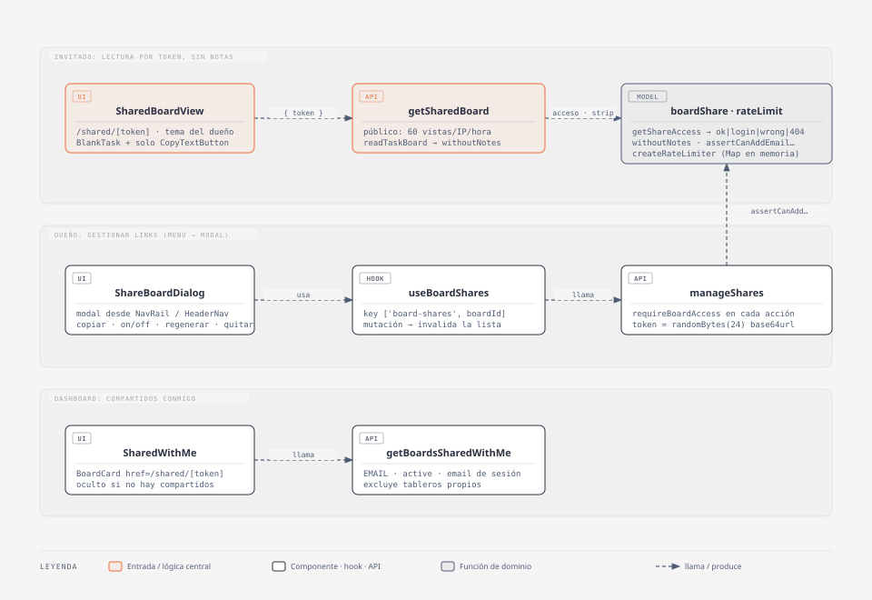

# Compartir tableros con Invitados

## Resumen

El dueño de un tablero lo comparte **completo y en solo lectura** con un **Invitado**: con un link público (cualquiera con el link) o con hasta 4 emails (solo quien inicie sesión con ese email). El Invitado ve todas las tareas en el mismo orden y columnas, **sin notas**, y solo puede copiar el texto de cada tarea.

> **"Invitado" ≠ "modo invitado".** Acá "Invitado" es quien _ve_ un tablero ajeno. El "modo invitado" es el usuario sin cuenta, con datos en `localStorage` (`GUEST_CUSTOM_TAG_GROUP_ID`, repositorios `localStorage*`, `userId ?? 'guest'`).

- **Código:** `web-app/src/features/board-share/` + `app/shared/[token]/`, `src/features/dashboard/ui/SharedWithMe.tsx`, `app/_components/` (item "Compartir tablero" en `NavRail` y `HeaderNav`, `getShareLink` en `navLinks.ts`), `src/features/tasks/api/readTaskBoard.ts`, `serverAuth.getSessionUser`.
- **Alcance:** link público, invitaciones por email, activar/desactivar, regenerar link, quitar invitado, "Compartidos conmigo" en el dashboard.
- **Fuera de alcance:** envío real de emails (sin SMTP), expiración automática, que el dueño elija si el Invitado ve las notas (hoy nunca las ve), escritura.

## Diagrama C4 — código

(fuente editable: `docs/diagramas/compartir-tableros-c4.html`; re-exportar el `.svg` tras editar el `.html`).

- `SharedBoardView` — la página del Invitado. Pide el tablero por token, muestra el estado (login requerido, cuenta equivocada, link inexistente, rate limit) o el tablero con el tema del dueño.
- `ReadOnlyBoard` — el tablero de solo lectura que muestra `SharedBoardView`. Arma las `Column` y pinta cada tarea con `ReadOnlyTask`.
- `ReadOnlyTask` — una tarea de solo lectura: `BlankTask` cuya única acción es `CopyTextButton` dentro de un `KebabMenu`, igual que en el tablero.
- `getSharedBoard` — única puerta de lectura para el Invitado: resuelve el acceso, limita vistas públicas y nunca devuelve notas.
- `ShareBoardDialog` + `useBoardShares` + `manageShares` — gestión del dueño, en un modal que se abre desde el menú (NavRail en escritorio, dropdown de HeaderNav en mobile). El panel solo se monta con el modal abierto, así los links no se piden en cada página.
- `SharedWithMe` + `getBoardsSharedWithMe` — el tablero aparece solo en el dashboard de la cuenta invitada, sin necesitar el link.

## Modelo / lógica

`model/boardShare.ts` (test: `model/boardShare.test.ts`):

- `getShareAccess(share, viewerEmail) → 'ok' | 'not-found' | 'login-required' | 'wrong-account'`.
  Inexistente e inactivo dan igual `not-found` (no revela que el link existió).
  Público → `ok` sin login. Email → compara con `normalizeEmail` (trim + lower).
- `assertCanAddEmailShare(shares, email)` — `BusinessError` si el email es
  inválido, ya está invitado o ya hay `MAX_EMAIL_SHARES = 4` de modo email (el
  público no cuenta). Corre en el cliente (para el toast) y en el server.
- `withoutNotes(taskBoard)` — saca `notesAndComments` de cada tarea. Se aplica
  en el server: las notas nunca viajan al Invitado.

`model/rateLimit.ts` (test: `model/rateLimit.test.ts`):
`createRateLimiter({ max, windowMs }) → (key, now?) => boolean`, ventana fija por clave en un `Map`. `getSharedBoard` lo usa con 60 vistas por IP por hora, solo en modo público. IP: ver Tips/historia.

Server actions (`api/actions/`):

- `getSharedBoard({ token })` → `{ status: 'ok', boardName, theme, taskBoard }` o `{ status }`. Test: `getSharedBoard.test.ts`.
- `manageShares.ts`: `getBoardShares`, `addEmailShare`, `enablePublicShare` (crea el único link público o lo reactiva), `setShareActive` (no toca el token → reactivar = mismo link), `regenerateShareToken` (token nuevo en la misma fila), `deleteShare`. Todas pasan por `requireBoardAccess(boardId)` y filtran por `{ id: shareId, boardId }`.
- `getBoardsSharedWithMe()` — shares `EMAIL` + activos del email de la sesión, excluyendo tableros propios.

## Persistencia y modelo

- Tipo TS: `BoardShare` en `model/boardShare.ts`.
- Prisma: `model BoardShare` (`boardId`, `mode: ShareMode` = `EMAIL | PUBLIC`,
  `token @unique`, `recipientEmail?`, `active @default(true)`, `createdAt`),
  `@@unique([boardId, recipientEmail])`, `@@index([recipientEmail])`,
  cascada con `Board`. Migración:
  `prisma/migrations/20260922120000_board_share/`. La corre el usuario.
- El límite 4 email + 1 público se valida en app (la DB solo impide emails
  repetidos por tablero; en Postgres los `NULL` no chocan en el unique).
- Lectura del tablero: `readTaskBoard(boardId)` (sin chequeo de acceso,
  `server-only`), compartido con `getTaskBoard` para que el Invitado vea
  exactamente el mismo orden que el dueño.

## i18next

- `share.*` — modal de compartir (títulos, botones, toasts); `share.section_title`
  es también el label del item del menú.
  `share.email_title` interpola `{{count}}/{{max}}`.
- `shared_board.*` — estados de la vista del Invitado.
- `dashboard.shared_with_me`.
- Archivos: `src/shared/i18n/es.json` y `en.json`.

## Tips / historia

- **Riesgo conocido: emails sin verificar.** El registro por email/password no verifica el email (sin SMTP). Si la cuenta invitada todavía no existe, cualquiera que tenga el link puede registrarse con ese email y ver el tablero.
  Aceptado en este corte; el arreglo es exigir `emailVerified` cuando haya envío de mails.
- El rate limit vive en memoria del proceso: en serverless cada instancia cuenta por su lado y se resetea con cada deploy. Pasar a tabla si hace falta un límite global.
- IP del rate limit: `x-nf-client-connection-ip` (Netlify) → `x-real-ip` (Vercel) → primer valor de `x-forwarded-for`. Ese último lo controla el cliente, así que fuera de esas plataformas el límite es burlable.
- Los límites (4 email / 1 público) son leer-y-crear sin transacción: dos requests simultáneos pueden pasarse del límite (p.ej. doble click en "crear link público"; la UI deshabilita el botón mientras hay una mutación en curso).
  Un unique parcial (`WHERE mode = 'PUBLIC'`) no se puede expresar en el schema Prisma sin que `migrate dev` lo vea como drift; se aceptó el riesgo.
- "Quitar invitado" (`deleteShare`) no estaba en la spec: sin él, los 4 cupos de email quedarían ocupados para siempre.
- La vista del Invitado no hace polling ni refetch al enfocar: cada fetch cuenta para el rate limit del link público.
- Tras loguearse desde el link de email, el usuario cae en el dashboard (el middleware manda `/auth` → `/dashboard`), donde el tablero aparece en "Compartidos conmigo". No hay redirect de vuelta al link.
- `/shared/*` lleva `robots: noindex` (el token es la credencial).
