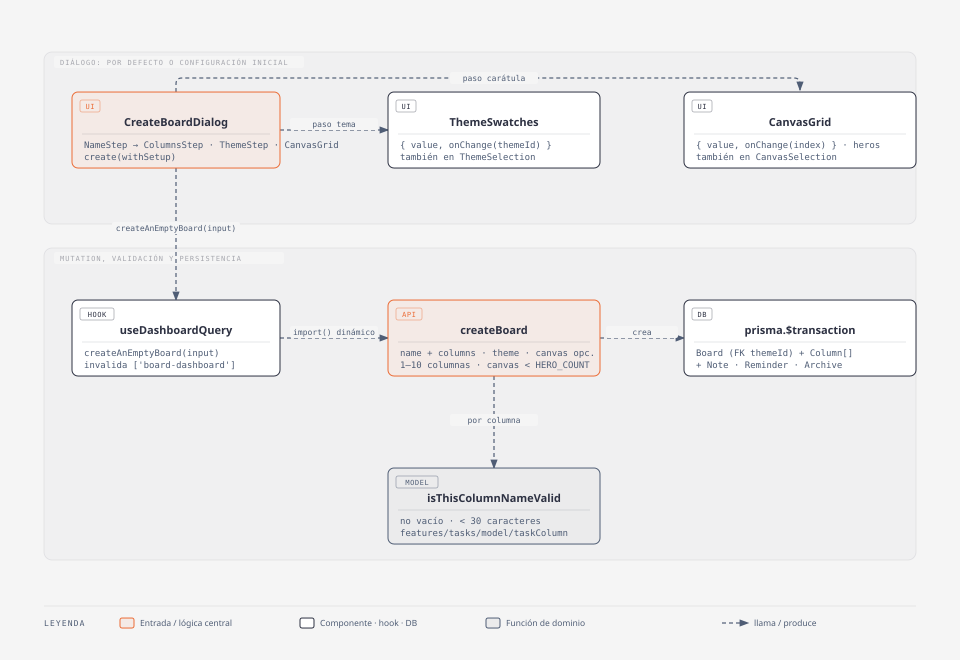

# Crear tablero

## Resumen

Desde el dashboard, el usuario con sesión crea un tablero de dos formas: **por
defecto** (solo nombre; columnas default, tema del dashboard y carátula
random) o con la **configuración inicial**, un wizard que deja elegir columnas,
tema y carátula antes de crearlo.

- **Código:** `web-app/src/features/dashboard/` (+ `shared/preferences/theme/ui/ThemeSelection.tsx`, `features/tasks/model/taskColumn.ts`)
- **Alcance / fuera de alcance:** columnas, tema y carátula al crear. Los tags quedan fuera del set-up (se configuran después, desde el tablero).

## Diagrama C4 — código

- **CreateBoardDialog** — el diálogo. Paso 0 pide el nombre y ofrece los dos caminos; los pasos 1–3 (columnas · tema · carátula) son la configuración inicial.
- **ThemeSwatches / CanvasGrid** — grillas controladas (`value` + `onChange`) extraídas de los selectores de Settings, así el wizard elige sin persistir y Settings persiste al elegir.
- **createBoard** — server action: valida todo y crea el tablero con sus columnas y accesorios en una transacción.

## Modelo / lógica

- `createBoard({ name, columns?, themeId?, cardCanvas? })` (`api/actions/createBoard.ts`, exporta el tipo `CreateBoardInput`):
  - nombre: no vacío y entre 3 y 14 caracteres (sin cambios).
  - `columns`: default `DEFAULT_COLUMN_IDS`; 1 a `MAX_COLUMNS` (5, `features/tasks/model/taskColumn.ts`); cada una pasa por `isThisColumnNameValid` (no vacía, < 30 caracteres).
  - `cardCanvas`: default random; entero en `[0, HERO_COUNT)`.
  - `themeId`: sin él queda el default del schema; si viene, la FK a `Theme` lo valida.
  - límite de `MAX_BOARDS` (5, `dashboard/model/board.ts`) tableros por usuario.
- Columnas default: el wizard arranca con las claves `todo · in_progress · done` y las muestra traducidas. Si el usuario no las toca, se guardan como claves (y se traducen en el cliente como siempre); al editarlas pasan a texto libre.
- "Crear por defecto" manda solo `{ name, themeId: <tema del dashboard> }`, aunque el usuario haya pasado por el wizard y vuelto atrás.
- El wizard no deja avanzar con una columna vacía ni borrar la última.

## Persistencia y modelo

- Sin cambios de schema ni migraciones: usa `Board.themeId`, `Board.cardCanvas` y `Column { name, order }` existentes.
- Solo usuarios con sesión (los invitados no crean tableros en la DB).

## i18next

Namespace `dashboard.*` en `es.json` / `en.json`:

- Nuevas: `create_default_board`, `initial_setup`, `setup_progress` (`{{step}}`, `{{total}}`), `setup_step_columns`, `setup_step_theme`, `setup_step_canvas`, `column_label` (`{{n}}`), `add_column`, `remove_column`, `next`, `back`, `columns_count_error` (`{{max}}`, lo lanza el server).
- `theme_pager.prev` / `theme_pager.next` (top-level): botones del paginador de temas.
- Cambiada: `new_board_description` (ya no dice que el tablero "estará vacío").

## Tips / historia

- 2026-09-28 — Se agrega el set-up inicial. Decisión: dos caminos (por defecto / wizard) en vez de forzar el wizard, para no frenar al que solo quiere un tablero rápido.
- 2026-09-28 — La vista previa del paso tema reusa `ThemePreview` envolviéndola en un `ThemeProvider` con el tema elegido, sin tocar el tema real de la página.
- 2026-09-28 — "Por defecto" ahora usa el tema del dashboard; antes el tablero quedaba siempre en `retro` (default del schema).
- 2026-09-28 — Los pasos se deslizan con `motion` (`AnimatePresence mode='wait'`, `x` según `dir`: adelante entra por la derecha, atrás por la izquierda). Con reduced-motion solo hay fade. La altura del contenido también se anima, así el modal no salta entre pasos de distinto alto.
- 2026-09-29 — El alto ya no se anima con `height` + `ResizeObserver` (re-layout por frame, React Doctor `no-layout-property-animation`): el wrapper usa `layout` (transform, requiere `domMax`) y el paso `layout="position"` para corregir la escala. Las columnas del paso 1 llevan una `key` estable (`newColumn`) en vez del índice, que re-asociaba inputs al borrar.
- 2026-09-28 — Bug: el paso tema desbordaba el modal (~29 temas + `ThemePreview`). Fix: `ThemeSwatches` tiene la prop `paginated`, que cambia la grilla completa por el subcomponente `ThemeSwatchesPager` (12 temas por página, botones Atrás/Siguiente, arranca en la página del tema elegido). El modal crece a `md:max-w-2xl` y el `DialogContent` tiene `max-h-[90dvh] overflow-y-auto` de respaldo. Settings sigue con la grilla completa.
- 2026-09-28 — Tope global de columnas: `MAX_COLUMNS = 5` en `taskColumn.ts`, aplicado al crear (`createBoard`, botón "Agregar columna" del wizard), al agregar desde el tablero (`addNewTaskColumn`, `AddNewColumnForm`) y en el server (`saveTaskBoard`). En `saveTaskBoard` solo se rechaza que el tablero crezca por encima del tope: los tableros previos con más columnas se siguen guardando.
- 2026-09-28 — `MAX_BOARDS` pasa de constante local en `createBoard` a `dashboard/model/board.ts`; `board_limit_error` interpola `{{max}}`.
