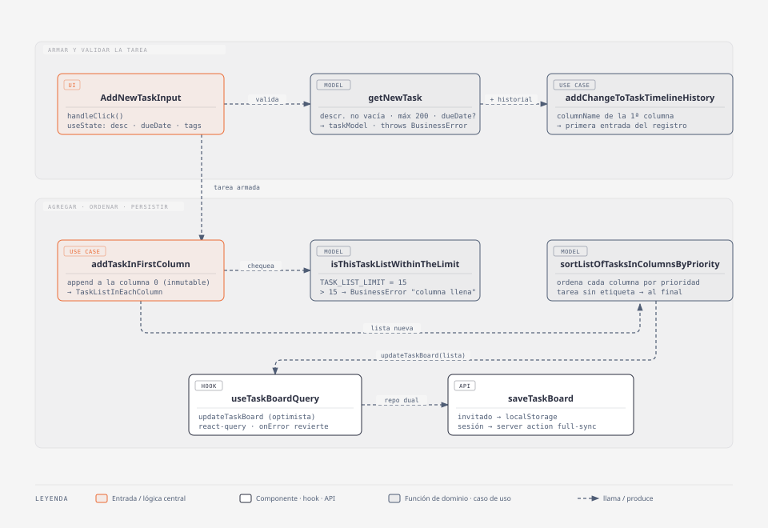

# Crear una tarea

## Resumen

El usuario escribe una descripción en el input de nueva tarea, opcionalmente le suma etiquetas y una fecha límite, y la tarea aparece en la **primera columna**, posicionada según la prioridad de su etiqueta. Es el único punto de entrada de tareas nuevas al tablero (mover y devolver del archivo reusan otras piezas). 

Funciona igual con o sin cuenta: sin sesión persiste en `localStorage`, con sesión hace full-sync contra la DB.

- **Código:** `web-app/src/features/tasks/` — `model/task.ts` (`getNewTask`,
  validaciones), `ui/taskList/components/AddNewTaskInput.tsx` (el input),
  `ui/taskList/useCase/addTask.ts` (`addTaskInFirstColumn`),
  `ui/taskList/models/taskListInEachColumn.ts` (límite por columna),
  `ui/taskList/models/sortListOfTasksInColumnsByPriority.ts`,
  `ui/taskList/useCase/addChangeToTaskTimelineHistory.ts`,
  `hooks/useTaskBoardQuery.tsx` (`updateTaskBoard`), `api/actions/saveTaskBoard.ts`.
- **Alcance:** alta de una tarea en la primera columna con descripción,
  etiquetas seleccionadas y fecha límite opcional; validación de descripción y
  del límite de la columna; ordenamiento por prioridad; primer entrada en el
  `timelineHistory`.
- **Fuera de alcance:** crear en otra columna que no sea la primera; editar la
  tarea ya creada (descripción, quitar/editar fecha); mover y archivar (features
  aparte). La fecha límite tiene su propio doc: `fecha-limite-tareas.md`.

## Diagrama C4 — código

Fuente editable: `docs/diagramas/crear-tarea-c4.html` (mismo estilo "UML class"
que el resto de `docs/diagramas/`; re-exportar el `.svg` tras editar el
`.html`). Fuera del diagrama por presupuesto: `TeaxtareaWithActions` (hospeda
el input y el `dateControl`), `TagGroupSelect` / `useUserSelectedTags` (aportan
`tags`), `useGetColumnNameFromPosition` (nombre de la 1ª columna para el
historial) y `joinTaskListsAndTaskBoard` (merge de la lista de columnas con el
`TaskBoard` dentro de `updateTaskBoard`).

Flujo: `AddNewTaskInput.handleClick` → `getNewTask({ descriptionText, dueDate? })`
(valida) → arma la tarea con `tags` (del `useTagStore`) y `timelineHistory`
(`addChangeToTaskTimelineHistory`) → `addTaskInFirstColumn` (append a la
columna 0 + `isThisTaskListWithinTheLimit`) → `sortListOfTasksInColumnsByPriority`
→ `updateTaskBoard` (react-query, optimista) → `saveTaskBoard`
(`localStorage` invitado / server action full-sync con sesión).

## Modelo / lógica

### `getNewTask({ descriptionText, dueDate? }) → taskModel`

`model/task.ts`, pura (test `model/task.test.ts`). Borde del modelo, no confía
solo en la UI:

- descripción vacía o solo espacios (`isThisTaskDescriptionValid`) →
  `throw new BusinessError('No se puede crear una tarea sin descripción.')`.
- `descriptionText.length > 200` → `throw new BusinessError('El texto es demasiado largo.')`.
- `id`: `crypto.randomUUID()`.
- `dueDate` (opcional): si viene y `!isValidDueDate(dueDate)` →
  `BusinessError('La fecha límite no es válida.')`. Detalle en `fecha-limite-tareas.md`.

No agrega `tags` ni `timelineHistory`: eso lo compone `AddNewTaskInput` antes
de llamar al use case.

### `addTaskInFirstColumn({ taskListInEachColumn, task }) → TaskListInEachColumn`

`ui/taskList/useCase/addTask.ts`, pura (test `addTask.test.ts`). Hace `map`
inmutable de las columnas y appendea `task` a la columna 0. Después llama a
`isThisTaskListWithinTheLimit({ taskList: nuevaColumna0 })`.

> `addTaskInTheLastColumn` vive en el mismo archivo pero es para devolver una
> tarea del archivo al tablero (feature `archived-tasks`), no para crear.

### `isThisTaskListWithinTheLimit({ taskList }) → true`

`ui/taskList/models/taskListInEachColumn.ts`. `TASK_LIST_LIMIT = 15`. Si
`taskList.length > 15` → `throw new BusinessError('La columna esta llena.')`.
El mismo guard lo usan `moveThisTask` y `moveThisTaskToThisColumn`.

- **2026-09-09:** el límite pasó de **10 a 15** (este cambio). Un solo lugar,
  todos los callers de tareas por columna rutean por acá.
- El chequeo es `> LIMIT`, no `>= LIMIT`: la columna admite hasta 15 tareas y
  el intento nº 16 lanza.
- El error es un string literal en `BusinessError`, no una clave i18n;
  `getErrorMessageForTheUser` lo devuelve tal cual al `toast`.

### `sortListOfTasksInColumnsByPriority(listOfTasksInColumns)`

`ui/taskList/models/`. Ordena cada columna por la prioridad más alta de sus
tags (`sortTasksByPriority`). Una tarea sin etiqueta queda al final de la
columna. Se corre sobre el resultado de `addTaskInFirstColumn`, así la tarea
nueva cae en su lugar y no siempre arriba.

### `addChangeToTaskTimelineHistory({ task, columnName }) → TaskTimelineHistory`

`ui/taskList/useCase/`. Primera entrada del registro de la tarjeta: `{ date:
new Date(), columnName }`. `columnName` viene de `useGetColumnNameFromPosition('1')`.
Si es `undefined`/`null`/`''` lanza `BusinessError`. No duplica si el último
cambio ya es esa misma columna.

### Reglas de negocio (resumen)

| Regla | Dónde se aplica |
| --- | --- |
| Descripción obligatoria, no vacía | `getNewTask` / `isThisTaskDescriptionValid` |
| Descripción ≤ 200 caracteres | `getNewTask` |
| Máximo 15 tareas por columna | `isThisTaskListWithinTheLimit` |
| Se crea solo en la primera columna | `addTaskInFirstColumn` (no hay otra vía) |
| Posición según prioridad de etiqueta | `sortListOfTasksInColumnsByPriority` |
| Fecha límite opcional y válida | `getNewTask` → `isValidDueDate` |

## Persistencia y modelo

- **Tipo:** `taskModel` en `model/task.ts` — `{ id, descriptionText, dueDate?,
  tags?, notesAndComments?, timelineHistory? }`. Al crear se setean `id`,
  `descriptionText`, y opcionalmente `tags`, `timelineHistory`, `dueDate`.
- **No hay campo ni migración nueva por este cambio:** el límite de 15 vive en
  una constante de front (`TASK_LIST_LIMIT`), no en el schema.
- **Prisma:** `model Task` ya existe (`descriptionText`, `columnId`, `order`,
  `dueDate?`, `tags Json?`, `notesAndComments?`, `timelineHistory Json?`). Sin
  cambios.
- **Modo invitado:** el tablero entero viaja como JSON en `localStorage`
  (`LocalStorageTaskListInEachColumnRepository`). La tarea nueva no necesita
  mapeo extra.
- **Con sesión:** `updateTaskBoard` → `saveTaskBoard` server action, que hace
  **full-sync** del snapshot (`tx.task.upsert` por tarea, borra las que no
  están). No hay endpoint granular de "crear tarea" en uso.

## i18next

Sin claves nuevas por este cambio. Las que toca el flujo de alta, en
`src/shared/i18n/es.json` y `en.json`:

- `new_task_placeholder` — "Nueva tarea..." / "New task..."
- `new_task_btn_title` — "Crear tarea" / "Create task"

El mensaje de columna llena (`"La columna esta llena."`) **no** pasa por
i18next: es el `message` del `BusinessError`, se muestra literal en el `toast`.

## Tips / historia

- **2026-09-09 — límite por columna 10 → 15.** Cambio de `TASK_LIST_LIMIT` en
  `ui/taskList/models/taskListInEachColumn.ts`. Ajustados los tests que
  llenaban la columna con 10 (`addTask.test.ts`, `moveTask.test.ts` → 15) y las
  menciones en `PRODUCT.md` y `docs/casos-de-uso.md`. El principio "Menos es
  foco" de `PRODUCT.md` sigue vigente, solo se subió el techo.
- **Decisión — un solo punto de alta.** No existe "crear en la columna N": la
  UI solo monta el input sobre la primera columna y `addTaskInFirstColumn` es
  el único use case de creación. Mantiene el modelo simple (Kanban de
  izquierda a derecha).
- **Decisión — `getNewTask` no compone `tags` ni `timelineHistory`.** La
  función de dominio solo valida y arma lo mínimo; la composición vive en el
  componente. Alternativa descartada: pasarle todo a `getNewTask` (acopla el
  modelo al `useTagStore` y al hook de nombres de columna).
- **Orden después de crear.** `sortListOfTasksInColumnsByPriority` corre sobre
  la lista ya con la tarea nueva: si tiene etiqueta de prioridad alta salta
  hacia arriba, si no queda al final. Sin esto, toda tarea nueva quedaría
  primera.
- **Guardas compartidas.** `isThisTaskListWithinTheLimit` es el mismo guard
  para crear y para mover (`moveThisTask`, `moveThisTaskToThisColumn`): subir
  el límite en un lugar lo sube para todos los flujos.
- **Límite conocido — validación optimista.** `updateTaskBoard` actualiza el
  cache antes de que responda el server (`onMutate`); si `saveTaskBoard` falla,
  `onError` revierte al snapshot previo. La validación real de negocio
  (descripción, límite) ya corrió en el cliente en `getNewTask` /
  `addTaskInFirstColumn`.
- **Código muerto.** `api/actions/createTask.ts` (y los otros CRUD granulares
  de `api/actions/`) no están cableados: el único camino de persistencia es
  `saveTaskBoard` full-sync. Candidatos a borrar.
- **2026-09-09 — C4 de código.** `docs/diagramas/crear-tarea-c4.{html,svg}`,
  dibujado a mano sobre el mismo patrón que `fecha-limite-c4.html` (la skill
  `diagram-design` no estaba disponible en la sesión).
- **Docs sincronizados:** `PRODUCT.md` (líneas de "Tareas" y "Menos es foco"),
  `docs/casos-de-uso.md` (`## Tareas`).
