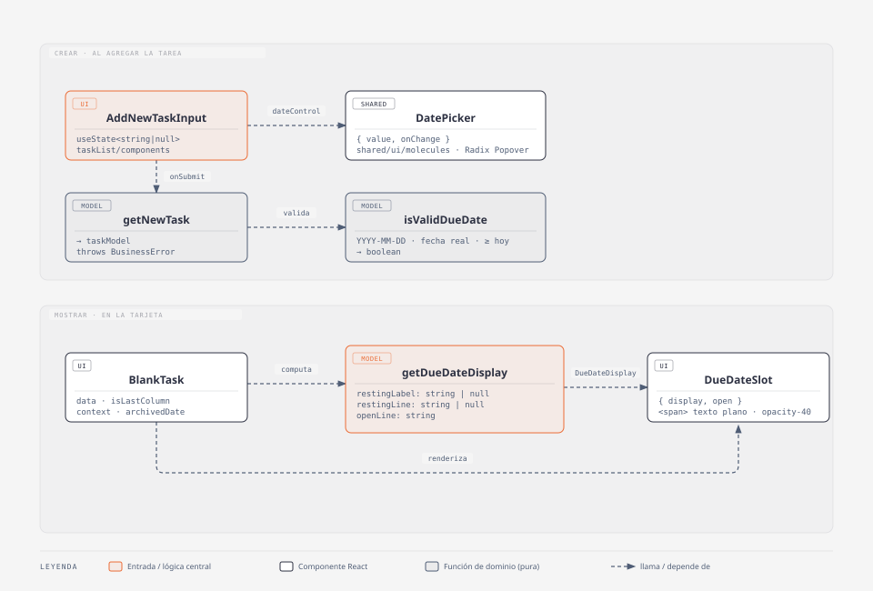

# Fecha límite en tareas

## Resumen

El usuario puede ponerle una **fecha límite opcional** a una tarea **al
crearla**. La tarjeta avisa la proximidad del vencimiento con una etiqueta
sobria (`Atrasado` / `Hoy` / `Para mañana` / `En 2 días`), y al abrir la
tarjeta muestra la fecha con el relativo (`12 sep | en 10 días`). En el
archivo se transforma en un balance de término (`Vencía … · Terminada … ·
terminada 3 días tarde`).

- **Código:** `web-app/src/features/tasks/` (`model/task.ts`, `ui/BlankTask.tsx`,
  `ui/DueDateSlot.tsx`, `ui/taskList/components/AddNewTaskInput.tsx`,
  `api/actions/{save,get}TaskBoard.ts`) + `src/shared/ui/molecules/DatePicker.tsx`.
- **Alcance:** setear la fecha al crear; indicadores en tablero y archivo.
- **Fuera de alcance:** editar la fecha de una tarea ya creada; registrar
  cambios de fecha en `timelineHistory`.

## Diagrama C4 — código

Fuente editable: `docs/diagramas/fecha-limite-c4.html` (skill `diagram-design`,
tipo "UML class"). Fuera del diagrama por presupuesto: `TextAreaWithActions`
(solo hospeda el slot `dateControl`), `TaskListArchived` (otro caller de
`BlankTask` con `context='archive'`) y `saveTaskBoard` / `getTaskBoard`
(mapeo del campo, ver *Persistencia y modelo*).

### `DatePicker` — `src/shared/ui/molecules/DatePicker.tsx`

Molécula compartida que le da al usuario una forma de elegir la fecha límite
sin salir del input de nueva tarea: un botón-calendario que abre un popover
con un calendario propio y devuelve la fecha elegida (o `null` al quitarla).
Objetivo: se siente parte del input, no del tablero (no toma el tema, "Regla
de los Inputs de Papel"), y resuelve el caso sin sumar una librería de
calendario.

### `DueDateSlot` — `src/features/tasks/ui/DueDateSlot.tsx`

Renderiza el estado de vencimiento en la tarjeta, en un único lugar que cambia
de contenido según la tarjeta esté cerrada o abierta. Objetivo: informar la
proximidad del vencimiento sin competir con las etiquetas de la tarea.

## Modelo / lógica

Todo en `features/tasks/model/task.ts`, con test `model/task.test.ts`
(`assert`-based: matriz de reposo, bordes de la ventana de urgencia, veredicto
del archivo).

### Validación al crear

- `isValidDueDate(dueDate, today = todayISODate())`: formato `YYYY-MM-DD`,
  fecha real (rechaza `2025-02-31`), no anterior a hoy (hora local).
- `getNewTask({ descriptionText, dueDate? })`: si `dueDate` viene y no es
  válida → `throw new BusinessError(...)`. Borde del modelo, no se confía
  solo en la UI.

### `getDueDateDisplay(input) → DueDateDisplay`

Input: `{ dueDate, today?, taskPriority, topPriority, isLastColumn, context,
archivedDate?, locale, t }`. La señal de prioridad entra como **números**
(`getHighestPriority(task.tags)` y `getHighestPriority(activeGroup.tags)`), no
como booleano. Salida: `{ restingLabel, restingLine, openLine }`.

**Fechas:** `@formkit/tempo`, locale es/en, día + mes abreviado. Año solo si
no es el año actual (`12 mar 2027`).

**Etiqueta en reposo (`restingLabel`, solo `context: 'board'`).** Escalera de
aviso según la prioridad: sin tags → 1 día · con tag → 2 · tag top
(`taskPriority === topPriority`) → 3. **Suprimida** en la última columna.

| vencimiento | sin tags | con algún tag | con el tag top |
| --- | --- | --- | --- |
| atrasada | `Atrasado` | `Atrasado` | `Atrasado` |
| vence hoy | `Hoy` | `Hoy` | `Hoy` |
| vence mañana | — | `Para mañana` | `Para mañana` |
| vence en 2 días | — | — | `En 2 días` |
| 3+ días | — | — | — |

**Línea expandida (`openLine`).** Para toda tarea con fecha: `{fecha} | {relativo}`.

| caso | ES | EN |
| --- | --- | --- |
| futuro | `12 sep \| en 10 días` | `Sep 12 \| in 10 days` |
| falta 1 | `12 sep \| en 1 día` | `Sep 12 \| in 1 day` |
| hoy | `12 sep \| hoy` | `Sep 12 \| today` |
| vencida | `9 sep \| hace 3 días` | `Sep 9 \| 3 days ago` |

**Archivo (`context: 'archive'`).** Sin `dueDate`: no muestra nada. Con
`dueDate`:

- Reposo (`restingLine`): `Vencía 12 sep · Terminada 15 sep · terminada 3 días tarde`
- Expandida (`openLine`): `Vencía 12 sep (hace 20 días) · Terminada 15 sep (hace 17 días) · terminada 3 días tarde`
- "Terminada" = `taskListArchived.date` (string ya localizado; se re-parsea
  con `parse(..., 'full')`). "(hace x días)" = relativo a hoy.
- Sin etiqueta de urgencia en el archivo.

| relación | ES | EN |
| --- | --- | --- |
| terminada antes | `terminada 2 días antes` | `finished 2 days early` |
| mismo día | `terminada a tiempo` | `finished on time` |
| terminada después | `terminada 3 días tarde` | `finished 3 days late` |

## Persistencia y modelo

- **Tipo:** `dueDate?: string` en `taskModel` (`model/task.ts`), formato
  `YYYY-MM-DD` sin hora.
- **Prisma:** `dueDate String?` en `model Task`. Migración commiteada en
  `prisma/migrations/20260906000000_task_due_date/migration.sql`
  (`ALTER TABLE "Task" ADD COLUMN "dueDate" TEXT;`). **La corre el usuario**
  (`prisma migrate deploy`) — el agente no toca la base.
- **Mapeo:** `saveTaskBoard.ts` (`create` y `update`: `dueDate: task.dueDate ??
  undefined`) y `getTaskBoard.ts` (`dueDate: t.dueDate ?? undefined`).
- **Modo invitado:** viaja en el JSON de `localStorage`, sin cambios extra.

## i18next

- Todo bajo el namespace **`due_date.*`** en `src/shared/i18n/es.json` y
  `en.json`. Ninguna cadena visible sin par ES/EN.
- Claves: `picker_btn`, `picker_remove`, `prev_month`, `next_month`,
  `resting.{overdue,today,tomorrow,in_2_days}`,
  `relative.{today,future_one,future_other,past_one,past_other}`,
  `archive.{due,done,verdict_on_time,verdict_early_*,verdict_late_*}`.
- Las cuentas de días usan formas `_one` / `_other` con `{{count}}`.

## Tips / historia

- **Decisión — fecha solo al crear.** Editar la fecha después y registrar el
  cambio en `timelineHistory` quedó fuera de alcance a propósito (spec de
  grilling). Si se agrega, el guard de `isValidDueDate` ya sirve.
- **Decisión — calendario a mano.** No se sumó `react-day-picker`; la grilla
  se arma con `@formkit/tempo` (ya instalado). ~40 líneas en `DatePicker`.
- **Decisión — `LazyMotion` + `m` en vez de `motion`.** El import directo de
  `motion` carga todo el runtime; `LazyMotion` + `domAnimation` recorta el
  bundle. Vino del pase de perf (`perf(react): … LazyMotion en DatePicker`).
  Skills consultadas: `motion-ui`, `motion-react`.
- **Cambio respecto de la spec — indicador en texto plano.** La spec original
  pedía un chip con tokens `gray-subtle` y `rounded`. Terminó siendo texto
  `opacity-40` sin caja, para no competir con las etiquetas de la tarea
  ("Voz Prestada" de `DESIGN.md`, rojo reservado para acciones irreversibles).
- **Cambio respecto de la spec — ubicación.** El indicador iba a vivir en el
  `<footer>` de tags de `BlankTask`; quedó en el `<header>` del `CardContent`.
- **Migración importante:** `20260906000000_task_due_date` — primera columna
  agregada a `Task` después del split a `web-app/`. Es aditiva y nullable, sin
  backfill.
- **Límite conocido — sin tick a medianoche.** Las etiquetas se recalculan al
  renderizar. Con la pestaña abierta toda la noche, "Para mañana" no pasa a
  "Hoy" hasta que algo re-renderice la tarjeta. Aceptable para v1.
- **Límite conocido — archivo.** Si `archivedDate` (string localizado) no se
  puede re-parsear, la línea cae a solo `Vencía {fecha}` (sin "Terminada" ni
  veredicto).
- **Docs sincronizados:** `docs/modelo-datos.md` (`Task.dueDate`), `PRODUCT.md`
  (línea de "Tareas"), `docs/casos-de-uso.md` (historia de usuario en
  `## Tareas`).
