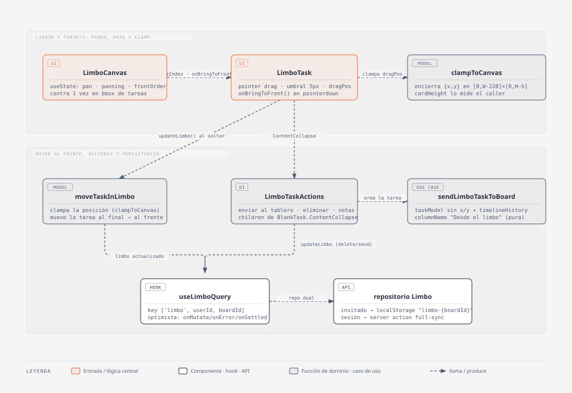

# Limbo

## Resumen

Un lienzo previo al tablero para **preservar ideas que todavía no son trabajo**:
brainstorm, purgatorio, lugar de espera indefinido. Sin tags, sin fechas, sin la
presión del tablero. El usuario tira ideas al lienzo, las mueve libremente y,
cuando una se decide a ser trabajo real, la manda al tablero con un click.

Un `LimboTask` **es** un `taskModel` (`id`, `descriptionText`, `notesAndComments`)
con `{ x, y }` en píxeles encima.

- **Código:** `web-app/src/features/limbo/` + `app/limbo/[id]/`, `BlankTask`
  (`context='limbo'`), `NavRail`/`Header` (item de menú), `userIsIn.ts`.
- **Alcance:** crear ideas, moverlas en el lienzo, notas, enviarlas al tablero,
  eliminarlas. Persistencia 1:1 con el tablero.
- **Fuera de alcance:** tags y fechas en el limbo, archivar (solo eliminar),
  volver una tarea del tablero al limbo, zoom del lienzo, multi-selección,
  lienzo colaborativo / tiempo real.

## Diagrama C4 — código

(fuente editable: `docs/diagramas/limbo-c4.html`, skill `diagram-design`, tipo
"UML class"; re-exportar el `.svg` tras editar el `.html`).

Flujo, en texto:

- `app/limbo/[id]/page.tsx` (`'use client'`) → `LimboPage` monta `PageContainer`
  (`whereUserIs=LIMBO`) + `useSyncBoardIdFromRoute()` y renderiza `<Limbo>`.
- `Limbo` (slice) elige por `useMediaQuery('(min-width: 768px)')` entre
  `LimboCanvas` (desktop) y `LimboMobileGrid` (mobile).
- `LimboCanvas` — contenedor fijo 2400×1600, estado de paneo (`translate` del div
  interno), handlers de rueda / botón central / arrastre del fondo. Centra el
  lienzo una vez sobre el bounding-box de las tareas existentes (no sobre el
  origen del canvas) y lleva un `frontOrder` (mapa `taskId → z-index`) que sube
  al frente la card clickeada/arrastrada. Renderiza un `LimboTask` por tarea +
  `LimboEmptyState` + `AddLimboTaskInput`. Sin color de fondo propio: deja ver
  el `theme.bg` de `PageContainer`, igual que el `Header`.
- `LimboTask` — `position:absolute` en desktop (`w-full` en el grid mobile),
  pointer-drag con umbral ~5px; al soltar llama `moveTaskInLimbo` (clampa +
  z-order del array) y `updateLimbo`. Monta `<BlankTask context="limbo">` con
  `<BlankTask.ContentCollapse><LimboTaskActions/>`.
- `LimboTaskActions` — 3 botones: `LimboNotesDialog` (notas), enviar al tablero
  (`sendLimboTaskToBoard` + `addTaskInFirstColumn` + `sortListOf…ByPriority`),
  eliminar (`deleteTaskFromLimbo`, con confirmación en `toast.warning`).
- `useLimboQuery` — fachada TanStack Query, optimista, key `['limbo', userId, boardId]`.

## Modelo / lógica

Tipos y funciones puras en `model/`; transformaciones de estado extra en `useCase/`.

### `model/limboTask.ts`

- `type LimboTask = taskModel & { x: number; y: number }`.
- Constantes: `LIMBO_TASK_LIMIT = 30`, `CANVAS_WIDTH = 2400`,
  `CANVAS_HEIGHT = 1600`, `CARD_WIDTH = 220`.
- `clampToCanvas({ x, y, cardHeight }) → { x, y }` — encierra la posición en
  `[0, CANVAS_WIDTH - CARD_WIDTH] × [0, CANVAS_HEIGHT - cardHeight]`. El
  `cardHeight` lo mide el caller (la card crece a lo alto según el título).

### `model/limbo.ts`

- `type Limbo = LimboTask[]`, `emptyLimbo: Limbo = []`. El **z-order es el orden
  del array**: la última card se dibuja al frente (sin campo `z`).
- `addTaskToLimbo({ limbo, task, x, y }) → Limbo` — agrega al final; lanza
  `BusinessError` si `limbo.length >= LIMBO_TASK_LIMIT`.
- `moveTaskInLimbo({ limbo, taskId, x, y, cardHeight? }) → Limbo` — clampa la
  posición y mueve la tarea al final del array (pasa al frente); no-op si el
  `taskId` no existe.
- `deleteTaskFromLimbo({ limbo, taskId }) → Limbo`.
- Test: `model/limbo.test.ts` (Vitest, sin framework nuevo).

### `useCase/updateLimboTaskNotes.ts`

`updateLimboTaskNotes({ limbo, taskId, notes }) → Limbo` — setea
`notesAndComments` de la tarea si `checkMaxLengthOfNotesAndComments(notes)`
(reusa el límite de 5000 de `features/tasks`); si no, devuelve el `limbo` igual.

### `useCase/sendLimboTaskToBoard.ts`

`sendLimboTaskToBoard({ task, movedFromLabel }) → taskModel` — pura: arma la
tarea de tablero sin `x`/`y` y le agrega una entrada de `timelineHistory` con
`columnName = movedFromLabel` (`t('limbo.moved_from_limbo')` → "Desde el limbo"
/ "From limbo") vía `addChangeToTaskTimelineHistory`. Test:
`useCase/sendLimboTaskToBoard.test.ts`.

### Enviar al tablero — `LimboTaskActions`

Reusa `addTaskInFirstColumn` + `sortListOfTasksInColumnsByPriority` (idéntico al
`AddNewTaskInput` del tablero; el sort ubica la tarea sin tags al fondo). Dos
mutaciones optimistas: quitar de `useLimboQuery` + agregar a `useTaskBoardQuery`.
Si la del tablero falla (`onError` de la mutación), se revierte la quita del
limbo (`addTaskToLimbo`) para que la idea nunca quede fuera de los dos lados. El
límite de columna (`addTaskInFirstColumn` lanza `BusinessError`) se chequea antes
de tocar el limbo.

### Crear — `AddLimboTaskInput`

Píldora flotante `fixed` centrada abajo, **solo título**. Reusa
`getNewTask({ descriptionText })` (no-vacío + `≤ 200`). Doble guard del límite de
30: la función pura `addTaskToLimbo` lanza `BusinessError`, y la UI deshabilita
el input + muestra un contador `text-xs` `"n/30"`. Spawn de la card nueva: centro
del área visible actual (`-panOffset + viewport/2`) + jitter ±40px; en mobile
`{ x: 0, y: 0 }` (no se usa).

### Lienzo — `LimboCanvas`

Paneo por `translate3d` del div interno (2400×1600). Disparadores: botón central
del mouse (cualquier lado) · rueda = vertical · `Shift`+rueda = horizontal ·
arrastrar el fondo vacío. Sin zoom, sin scrollbars (`overflow-hidden`). El
`wheel` se escucha con `{ passive: false }` para poder `preventDefault`. El paneo
se clampa para que el lienzo no deje hueco.

Centrado inicial: un `useEffect` (guardado por un ref `centeredRef`, corre una
sola vez y solo cuando `limbo.length > 0`) calcula el bounding-box de las
posiciones existentes y centra el viewport ahí — no en el origen del canvas.
Si el limbo llega vacío no hay nada que centrar; el primer render usa el pan
por defecto.

Traer al frente: `frontOrder` (`Record<taskId, number>` en `useState`) +
`zCounter` (`useRef`, contador incremental). `bringToFront(taskId)` sube el
contador y escribe `frontOrder[taskId]`; se llama en el `pointerdown` de cada
`LimboTask` (click o el inicio de un drag), y su valor se pasa como prop
`zIndex`. Es **solo visual** — no toca el array del `limbo` ni se persiste; el
orden real (para el próximo render) lo sigue fijando `moveTaskInLimbo` al
soltar un drag.

### Card — `LimboTask` (interacción)

Pointer events (`pointerdown`/`move`/`up`), umbral ~5px para distinguir drag de
click. Si superó el umbral, `stopPropagation` en el `onClickCapture` para que el
click no dispare el collapse de `BlankTask`. `onPointerDown` llama
`onBringToFront?.()` (viene de `LimboCanvas`) sea click o drag.

**Fix del fantasma:** durante el drag y justo después de soltar, la card no usa
`task.x/task.y` sino un estado local `dragPos` (posición absoluta en el
canvas, no un offset relativo). Al soltar, `dragPos` se fija en la posición ya
clampeada (`clampToCanvas`) — la misma que se manda a `moveTaskInLimbo` — y un
`useEffect` recién lo limpia (`dragPos = null`) cuando `task.x/task.y` (el
dato persistido, que vuelve por la query) coincide con ese valor. Antes, la
card volvía por un instante a la posición vieja (o saltaba de más) mientras el
guardado optimista todavía no confirmaba; ahora se queda quieta en el punto
donde se soltó. Mientras `dragPos` no es `null`, `zIndex` fijo en `9999`
(por encima de `frontOrder`).

En mobile la card se renderiza sin drag (`draggable` es `false`), con
`className='w-full'` para ocupar el ancho de la columna en vez del
`max-w-[220px]` fijo del lienzo desktop (ver `BlankTask` más abajo).

## Persistencia y modelo

- **Tipos:** `Limbo = LimboTask[]` (`model/`).
- **Prisma:** `model Limbo` (espeja `Archive`) — `boardId String @unique`,
  `tasks Json @default("[]")`, `onDelete: Cascade`; `limbo Limbo?` en `Board`.
  Migración: `prisma/migrations/20260910180000_limbo/migration.sql`
  (`CREATE TABLE "Limbo"` + FK cascade + índice único). **La corre el usuario.**
- **Server actions** (`api/actions/`): `getLimbo({ boardId })` →
  `prisma.limbo.findUnique`, retorna `tasks ?? []`; `saveLimbo({ boardId, tasks })`
  → `prisma.limbo.upsert`. Ambas validan con `requireBoardAccess(boardId)`.
  Full-sync del snapshot completo (molde `getArchive` / `saveArchive`).
- **Repositorio dual** (`api/repository/`): interfaz `LimboRepository` +
  `NextjsLimboRepository` (import dinámico de las actions) y
  `LocalStorageLimboRepository`. Modo invitado = `localStorage` con key **por
  board**: `limbo-{boardId}` (no el bucket único que usa el archivo). `index.ts`
  expone `fetchLimbo` / `saveLimboTasks` + selector por `session`.
- **Query hook:** `useLimboQuery` — key `['limbo', userId, boardId]`, optimista
  (`onMutate` / `onError` / `onSettled`, molde `useArchivedTasksQuery`). Expone
  `limbo`, `updateLimbo`, `isSaving`.
- **`BlankTask`:** `context` acepta `'limbo'`; con ese valor la `<Card>` recibe
  `max-w-[220px]`. Acepta además un `className?` que se mergea (`cn`) al final
  de las clases de la `Card` — gana sobre el `max-w-[220px]` de `context='limbo'`,
  lo usa `LimboTask` en mobile para pasar `w-full` y ocupar el ancho de la
  columna. El título no se recorta (la card crece a lo alto). No cambia la
  lógica de due-date (las tareas del limbo no tienen `dueDate`).

## i18next

Namespace **`limbo.*`** + `menu.limbo`, en `src/shared/i18n/es.json` y `en.json`
(ningún par sin ES/EN):

| clave | ES | EN |
| --- | --- | --- |
| `menu.limbo` | Limbo | Limbo |
| `limbo.title` | Limbo | Limbo |
| `limbo.new_task_placeholder` | Nueva idea... | New idea... |
| `limbo.counter` | `{{count}}/{{max}}` | `{{count}}/{{max}}` |
| `limbo.full_hint` | Límite alcanzado | Limit reached |
| `limbo.send_to_board` | Enviar al tablero | Send to board |
| `limbo.send_to_board_toast` | La idea pasó al tablero. | The idea moved to the board. |
| `limbo.delete` | Eliminar | Delete |
| `limbo.delete_warning` | ¿Seguro desea eliminar esta idea?… | Delete this idea?… |
| `limbo.moved_from_limbo` | Desde el limbo | From limbo |
| `limbo.empty_copy` | Un lugar de espera para ideas… | A waiting place for ideas… |
| `limbo.notes_title` | Notas | Notes |

El diálogo de notas reusa `task_notes.placeholder`, `task_notes.max_length_toast`
y `task_notes.save_toast`.

## Tips / historia

- **Decisión — `LimboTask` es un `taskModel` + `{x,y}`.** Reusa `getNewTask`,
  `BlankTask`, el editor de notas y todo el pipe de enviar al tablero. El limbo
  no agrega modelo de tarea nuevo, solo posición encima.
- **Decisión — z-order = orden del array, más un `frontOrder` visual
  (2026-09-10).** El orden persistido sigue siendo el orden del array (lo fija
  `moveTaskInLimbo` al soltar un drag); no hay campo `z`. Encima, `LimboCanvas`
  agrega un `frontOrder` (`taskId → z-index`, solo estado de UI, no se guarda)
  para poder traer una card al frente con un simple click, sin que eso dispare
  un guardado ni reordene el array hasta que efectivamente se la arrastra.
- **Bug — fantasma al soltar un drag (2026-09-10).** La card volvía un
  instante a la posición vieja (o saltaba de más) mientras el guardado
  optimista de `moveTaskInLimbo` todavía no confirmaba. Causa: la posición en
  pantalla se calculaba como offset relativo sobre `task.x/task.y`, que
  cambiaban de golpe cuando llegaba la data persistida. Fix: estado `dragPos`
  con la posición absoluta ya clampeada, que se limpia recién cuando
  `task.x/task.y` coincide con ese valor — ver [Card — `LimboTask`
  (interacción)](#card--limbotask-interacción).
- **Decisión — key de `localStorage` por board (`limbo-{boardId}`).** A
  diferencia del archivo (bucket único `tasks-archive`), cada tablero invitado
  tiene su propio limbo, igual que en el modo logueado (1:1 con `Board`).
- **Techo conocido (`LimboCanvas.tsx`).** Lienzo de tamaño fijo
  2400×1600. Si 30 cards con títulos largos se amontonan demasiado en la
  práctica, el upgrade es un lienzo auto-creciente. No se construye ahora (YAGNI).
- **Bug — `AddLimboTaskInput` no se montaba con el limbo vacío (2026-09-10).**
  `LimboCanvas` y `LimboMobileGrid` hacían `return` anticipado con
  `LimboEmptyState` cuando `limbo.length === 0`, sin renderizar
  `AddLimboTaskInput`. Como todo limbo arranca vacío (la tabla `Limbo` no se
  precarga, se crea recién al primer `saveLimbo`), nadie podía crear la
  primera idea: el input para salir del estado vacío estaba condicionado a no
  estar en el estado vacío. Fix: ambos componentes ahora renderizan
  `AddLimboTaskInput` también en la rama de `limbo.length === 0`.
