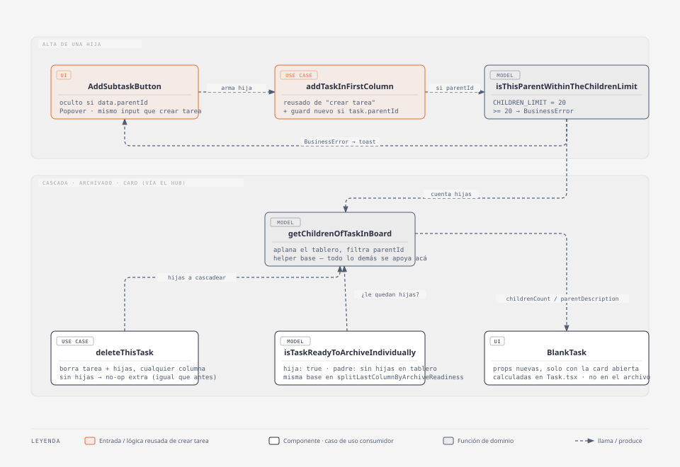

# Sub-tareas

## Resumen

Una tarea puede tener hasta 20 hijas. Las hijas son tareas normales — mismo
modelo, mismo drag-and-drop, mismo límite de 15 por columna — enlazadas a un
padre por `parentId`. Un solo nivel: una hija no puede tener hijas propias. El
padre no puede archivarse individualmente hasta que todas sus hijas ya estén
archivadas; borrar un padre borra sus hijas en cascada.

- **Código:** `web-app/src/features/tasks/` (modelo, alta, borrado, límite,
  card del tablero) + `web-app/src/features/archived-tasks/` (anidado en el
  archivo, salteo en `ArchiveTaskListButton`).
- **Alcance:** alta de una hija desde la tarea padre, límite de 20 hijas,
  card del tablero (texto del padre en la hija, número de hijas en el padre),
  borrado en cascada con confirmación, gate de archivado individual, salteo en
  el archivado de toda la columna, anidado en el archivo.
- **Fuera de alcance:** más de un nivel (nietos), desvincular una hija de su
  padre o convertir una tarea existente en hija, listado de hijas al clickear
  el padre en el tablero (solo el número), cambios al límite de 15 por
  columna.

## Diagrama C4 — código

`getChildrenOfTaskInBoard` es el hub: lo único de lo que dependen el límite de
20 hijas, la cascada de borrado, el gate de archivado individual y el
`childrenCount`/`parentDescription` de la card. `addTaskInFirstColumn` es la
misma función de "crear tarea", con un guard nuevo antepuesto solo si
`task.parentId`.

Flujo, en texto:

- `AddSubtaskButton` (en `TaskInBoardActions`, oculto si `data.parentId`) —
  `Popover` con el mismo `TeaxtareaWithActions` que `AddNewTaskInput` (texto,
  `TagGroupSelect`, `DatePicker`): mismo input de alta, distinto lugar de
  montaje (popover anclado al botón en vez de fijo en la columna). Arma la
  hija con `getNewTask` + `parentId` del padre y la manda a
  `addTaskInFirstColumn`, igual que `AddNewTaskInput`.
- `addTaskInFirstColumn` — antes de appendear corre
  `isThisParentWithinTheChildrenLimit` si la tarea trae `parentId` (única vía
  de alta de hijas, así que es el único lugar donde hace falta el chequeo).
- `getChildrenOfTaskInBoard(taskListInEachColumn, parentId)` — helper base:
  aplana el tablero y filtra por `parentId`. Todo lo demás de la feature se
  arma sobre este helper.
- `deleteThisTask` — ahora borra la tarea **y** sus hijas (`getChildrenOfTaskInBoard`),
  en cualquier columna en la que estén. Para una tarea sin hijas es un no-op
  extra (mismo comportamiento de siempre).
- `DeleteTaskButton` — si la tarea tiene hijas, `toast.warning` de cascada
  siempre (sin importar la columna); si no, la regla de siempre
  (`isTheTaskInTheFirstColumn`).
- `isTaskReadyToArchiveIndividually` — una hija siempre está lista; un padre
  solo si no le queda ninguna hija en el tablero. La usa `TaskInBoardActions`
  para ocultar `ArchiveTaskButton`.
- `splitLastColumnByArchiveReadiness` — separa la última columna en `ready` /
  `notReady` (padres incompletos). La usa `ArchiveTaskListButton`: archiva
  `ready`, deja `notReady` donde estaba, no bloquea el resto de la columna.
- `BlankTask` — dos props nuevas, solo pintan con la card abierta
  (`show`) y solo las pasa `Task.tsx` (contexto `board`; no
  `TaskListArchived.tsx`, ver Tips/historia):
  - `parentDescription` — texto del padre arriba de la descripción,
    `opacity-65 text-xs`.
  - `childrenCount` — `t('subtasks.count', { count })` en el mismo estilo,
    en vez de un listado.
- `TaskListArchived` — si la tarea archivada no es una hija, agrega
  `ArchivedChildren`: busca sus hijas en **todo** el archivo
  (`getArchivedChildren`, no solo el día del padre) y renderiza una card
  `BlankTask context='archive'` completa por cada una, anidada. Duplicado
  intencional: la hija también aparece suelta en su propio día.

## Modelo / lógica

### `taskModel.parentId?: string`

`model/task.ts`. Presente solo en hijas. Una hija no puede tener `parentId`
propio en sus hijas porque no se ofrece ninguna vía de alta para eso (un solo
nivel, forzado por UI: `AddSubtaskButton` no aparece si `data.parentId`).

### `ui/taskList/models/taskListInEachColumn.ts`

Todos los helpers de sub-tareas viven acá, junto al límite de columna que ya
existía:

| función | qué hace |
| --- | --- |
| `getChildrenOfTaskInBoard(taskListInEachColumn, parentId)` | `TaskList` — hijas de `parentId` en cualquier columna del tablero. |
| `isThisParentWithinTheChildrenLimit({ taskListInEachColumn, parentId })` | `true` \| `BusinessError('Esta tarea ya tiene el máximo de subtareas.')` si ya tiene 20. |
| `isTaskReadyToArchiveIndividually(taskListInEachColumn, task)` | `boolean` — `true` si es hija, o si es padre sin hijas en el tablero. |
| `splitLastColumnByArchiveReadiness(taskListInEachColumn, lastColumnIndex)` | `{ ready, notReady }` de la última columna. |

`CHILDREN_LIMIT = 20`, constante privada del archivo (no exportada, como
`TASK_LIST_LIMIT`).

### Reglas de negocio (resumen)

| Regla | Dónde se aplica |
| --- | --- |
| Máximo 20 hijas por padre | `isThisParentWithinTheChildrenLimit`, llamado desde `addTaskInFirstColumn` si `task.parentId` |
| Un solo nivel | No hay UI para crear una hija de una hija (`AddSubtaskButton` se oculta) |
| Hija nace en la primera columna | Mismo `addTaskInFirstColumn` que cualquier tarea nueva |
| Borrar un padre borra sus hijas | `deleteThisTask` — cascada vía `getChildrenOfTaskInBoard`, en cualquier columna |
| Padre no se archiva solo hasta que las hijas ya estén archivadas | `isTaskReadyToArchiveIndividually` |
| Archivar toda la columna no bloquea por un padre incompleto | `splitLastColumnByArchiveReadiness` |

Tests: `addTask.test.ts` (límite de 20), `deleteTask.test.ts` (cascada),
`taskListInEachColumn.test.ts` (los cuatro helpers), `archive.test.ts`
(`getArchivedChildren`).

## Persistencia y modelo

- **Prisma:** `model Task` — campo `parentId String?` + self-relation
  (`parent`/`children`, nombre de relación `"TaskChildren"`),
  `onDelete: Cascade` desde el padre. La migración la corre el usuario
  (`prisma migrate dev`); `prisma generate` ya se corrió para el client.
- **`getTaskBoard.ts`:** mapea `parentId: t.parentId ?? undefined`.
- **`saveTaskBoard.ts`` (full-sync):** el `data` del upsert incluye
  `parentId: task.parentId ?? null`. El upsert de tareas se separa en dos
  pasadas — primero las que no tienen `parentId`, después las que sí —
  porque una hija nace siempre en la columna 0 pero su padre puede estar en
  cualquier otra columna, y el full-sync anterior upserteaba columna por
  columna en orden: si ambas eran nuevas en el mismo `saveTaskBoard`, la hija
  podía intentar upsertear antes de que el padre existiera y violar el FK. Ver
  Tips/historia.
- **Modo invitado:** sin cambios — `parentId` viaja como cualquier otro campo
  del `taskModel` en el JSON de `localStorage`.
- **Archivo (`Archive`):** sigue siendo un Json blob por board, sin relación a
  `Task` en DB — `parentId` viaja igual que `dueDate` o `tags`, sin mapeo
  especial. `getArchivedChildren(archive, parentId)` (`model/archive.ts`)
  busca hijas archivadas en cualquier día del array.

## i18next

Namespace **`subtasks.*`** nuevo, en `src/shared/i18n/es.json` y `en.json`:

| clave | ES | EN |
| --- | --- | --- |
| `subtasks.add_btn` | Subtarea | Subtask |
| `subtasks.placeholder` | Nueva subtarea... | New subtask... |
| `subtasks.count_one` / `_other` | `{{count}} subtarea` / `{{count}} subtareas` | `{{count}} subtask` / `{{count}} subtasks` |
| `subtasks.delete_parent_warning` | ¿Seguro desea eliminar esta tarea y todas sus subtareas? No es posible deshacer esta acción. | Are you sure you want to delete this task and all its subtasks? This action cannot be undone. |

`count` usa la pluralización automática de i18next (`_one`/`_other`), sin
helper manual — a diferencia de `getDueDateDisplay` (que arma una oración
compuesta y por eso resuelve el sufijo a mano), acá el `t()` es la cadena
completa.

El mensaje del límite de 20 (`"Esta tarea ya tiene el máximo de subtareas."`)
**no** pasa por i18next: es el `message` de un `BusinessError`, mismo patrón
que `"La columna esta llena."`.

## Tips / historia

- **Decisión — helpers de sub-tareas viven en `taskListInEachColumn.ts`, no en
  un archivo nuevo.** Es donde ya vivía `isThisTaskListWithinTheLimit`, el
  guard más parecido; todos necesitan el mismo dato de entrada
  (`taskListInEachColumn`) y evita otro archivo de una función.
- **Decisión — `deleteThisTask` cambia para todos los callers, no solo para
  padres.** Antes buscaba la columna de la tarea con `findTaskColumnIndex` y
  filtraba ahí; ahora filtra por id en las N columnas directamente (más
  simple, y de paso cascadea las hijas). Para una tarea sin hijas el filtro
  extra es un no-op — mismo resultado que antes.
- **2026-09-14 — bug: mover un padre a otra columna borraba a sus hijas.**
  `moveThisTaskToThisColumn` (drag-and-drop) reusaba `deleteThisTask` como
  primitiva de "sacar la tarea de su columna actual" antes de reinsertarla en
  la nueva — un acoplamiento que ya existía. Al volver cascada a
  `deleteThisTask` (punto anterior), ese mismo call site pasó a borrar
  también las hijas del padre movido, y como solo el padre se reinsertaba,
  las hijas desaparecían del tablero. Causa raíz: `deleteThisTask` mezclaba
  dos operaciones distintas (borrar de verdad vs. sacar-para-reinsertar). Fix:
  se separó `removeThisTaskFromItsColumn` (sin cascada, sin tocar hijas) y
  `moveThisTaskToThisColumn` pasó a usar esa en vez de `deleteThisTask`. Test
  de regresión en `moveThisTaskToThisColumn.test.ts`.
- **Decisión — el conteo de hijas (límite de 20, "listo para archivar",
  card del padre) es siempre sobre el tablero, nunca sobre el archivo.** Las
  hijas ya archivadas no cuentan para el límite de 20 ni aparecen en el
  número de la card; es el dato que ya tenían disponible los call sites
  (`taskListInEachColumn`) sin acoplar `tasks` a `archived-tasks`.
- **Decisión — texto del padre / número de hijas solo en `context='board'`.**
  `TaskListArchived` no les pasa esas props a `BlankTask`: en el archivo la
  relación padre-hija ya se ve por el anidado (`ArchivedChildren`), duplicarla
  como texto hubiera sido ruido.
- **Bug evitado — orden de upsert en `saveTaskBoard`.** Ver Persistencia y
  modelo: sin la pasada en dos tiempos, crear un padre y una hija en el mismo
  guardado podía violar el FK de `parentId` según en qué columna estuviera el
  padre. No se detectó con los tests existentes (todos in-memory, sin DB real)
  — quedó razonado a mano al escribir el full-sync.
- **Límite conocido — condición de carrera preexistente del full-sync.** Si
  dos `updateTaskBoard` se disparan casi juntos (ej. crear un padre y
  agregarle una hija sin esperar el primer guardado), el snapshot completo
  puede pisarse entre sí — no es nuevo de esta feature, pero el FK de
  `parentId` lo puede convertir en un error visible (antes era, en el peor
  caso, un dato perdido silencioso). No se aborda acá.
