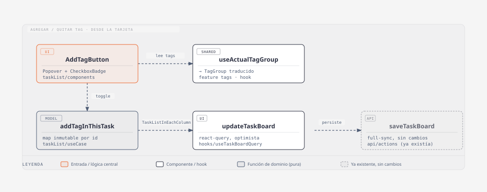

# Tags en una tarea existente

## Resumen

El usuario puede tildar/destildar los tags del grupo activo del tablero sobre
una tarea que ya existe, desde el menú kebab de la tarjeta (`Agregar tag`), sin
pasar por el flujo de creación. A diferencia de la fecha límite (que solo
admite *agregar*, no editar), acá se puede alternar libremente: tildar suma el
tag, destildar lo quita.

- **Código:** `web-app/src/features/tasks/ui/taskList/components/AddTagButton.tsx`,
  `ui/taskList/useCase/addTagInThisTask.ts`, `ui/taskList/components/TaskInBoardActions.tsx`
  (donde se monta) + `features/tags/` (`useActualTagGroup`, `translateTagGroup`,
  `Tag`) que ya existía para el flujo de creación.
- **Alcance:** alternar tags del grupo activo sobre una tarea ya creada.
- **Fuera de alcance:** crear o editar el grupo de tags en sí (`EnableTags`
  para activar un grupo, [tags-personalizados](./tags-personalizados.md) para
  crear tags propios); tags fuera del grupo activo del tablero.

## Diagrama C4 — código

### `AddTagButton` — `ui/taskList/components/AddTagButton.tsx`

Acción de la tarjeta (en `TaskInBoardActions`, dentro del `KebabMenu`). Abre un
popover propio con un `CheckboxBadge` por tag del grupo activo
(`useActualTagGroup`), tildado según `task.tags`. No se apoya en
`useTagStore`/`useUserSelectedTags` (eso es estado de selección *previo a
crear* la tarea, se limpia después de usarse) — lee y escribe directo sobre
`task.tags`. Si el tablero no tiene grupo de tags habilitado
(`emptyTagGroup`, `tags: []`), el botón no renderiza nada.

Texto e ícono del disparador cambian según `task.tags`: sin etiquetas
`TagPlusIcon` + "Agregar etiqueta" (`task_buttons.add_tag`); con al menos una,
`TagIcon` + "Etiquetas" (`task_buttons.tags`).

## Modelo / lógica

### `addTagInThisTask({ taskListByColumns, task, tags }) → TaskListInEachColumn`

`ui/taskList/useCase/addTagInThisTask.ts`, pura (test `addTagInThisTask.test.ts`).
`map` inmutable de las columnas: reemplaza el array `tags` completo de la
tarea que matchea por `id`. No mergea ni dedupea — `AddTagButton` ya arma la
lista final (agrega o filtra el tag tildado/destildado) antes de llamar acá.
No valida nada (a diferencia de `setDueDateOfThisTask`): cualquier `Tag[]` es
válido, incluida la lista vacía (quitar todos los tags).

## Persistencia y modelo

- **Tipo:** `tags?: Tag[]` en `taskModel` (`model/task.ts`) — ya existía para
  el alta con tags al crear.
- **Sin campo ni migración nueva:** `Task.tags Json?` en `schema.prisma` ya
  soporta esto.
- **Persistencia:** igual que el resto de las acciones de tarjeta
  (`SetDueDateButton`, `DeleteTaskButton`): `updateTaskBoard` → `saveTaskBoard`
  full-sync, sin endpoint granular.

## i18next

- `task_buttons.add_tag` — "Agregar etiqueta" / "Add tag" (sin etiquetas) y
  `task_buttons.tags` — "Etiquetas" / "Tags" (con al menos una), en
  `src/shared/i18n/es.json` y `en.json`. Los nombres de los tags en sí ya
  tenían sus claves (`tags.*`, `dev_tags.*`) vía `translateTagGroup`.

## Tips / historia

- **2026-09-16 — bug: la tarjeta perdía nombre/color al borrar el tag
  original.** `task.tags` ya guardaba el `Tag[]` completo (nombre traducido,
  `variant`, `priority`) al momento de taggear — tanto al crear la tarea
  (`TagGroupSelect`) como al taggearla después (`AddTagButton`). El bug
  estaba en la lectura: `BlankTask.tsx` ignoraba ese snapshot y volvía a
  resolver cada tag por `id` contra `useAvailableTags()` (el grupo *vigente*
  del board), así que un tag borrado (o el grupo desactivado) hacía
  desaparecer el badge de tarjetas que ya lo tenían. Fix de raíz en el único
  punto de render compartido por board/archivo/limbo: `BlankTask` ahora usa
  `data.tags` directo (`const taskTags = data.tags ?? []`), sin pasar por
  `useAvailableTags`. Efecto secundario esperado: editar un tag ya no
  actualiza retroactivamente las tarjetas que lo tenían aplicado (queda
  congelado al momento de taggear), consistente con no perder el tag si se
  borra.
- **2026-09-15 — alta.** `addTagInThisTask.ts` existía como código muerto
  (nadie lo llamaba) desde antes de este cambio; se activó tal cual estaba,
  sin tocar su firma.
- **Decisión — alternar, no solo agregar.** A diferencia de la fecha límite
  (agregar-solo, editar fuera de alcance), acá se permite destildar: no hay
  razón de negocio para bloquear quitar un tag ya puesto, y el modelo
  (`Tag[]`) no distingue "primera vez" de "edición" como sí lo hace `dueDate`.
- **Reuso deliberado.** El picker es un popover propio en vez de reusar
  `TagGroupSelect` tal cual: ese componente está acoplado a `useTagStore`
  (selección previa a crear), acá la fuente de verdad es `task.tags`. Se
  reusan sus piezas (`CheckboxBadge`, `useActualTagGroup`, `translateTagGroup`)
  pero no el componente completo.
