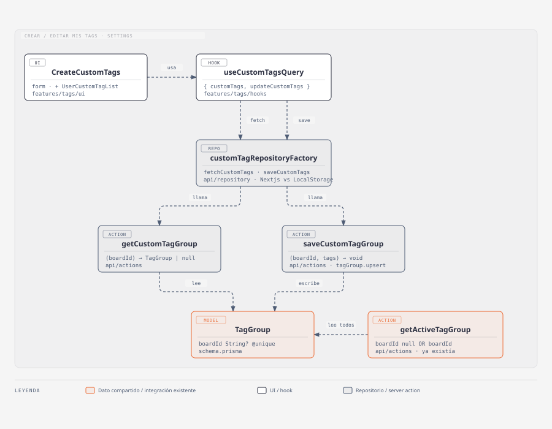

# Tags personalizados

## Resumen

El dueño de un board puede crear sus propias etiquetas (nombre, prioridad y
color) en vez de estar limitado a los dos grupos predefinidos
(Eisenhower/Dev). Las etiquetas propias viven en un `TagGroup` exclusivo de
ese board y se activan solas al crear/editar un tag: no hace falta ir a
"Etiquetas disponibles" (`EnableTags`) a buscarlas y tildarlas a mano.

- **Código:** `web-app/src/features/tags/ui/CreateCustomTags.tsx` (form),
  `ui/UserCustomTagList.tsx` (lista + borrado), `hooks/useCustomTagsQuery.tsx`,
  `api/repository/customTagRepositoryFactory.ts` (+ repos Nextjs/LocalStorage),
  `api/actions/getCustomTagGroup.ts`, `api/actions/saveCustomTagGroup.ts`
  (+ `getActiveTagGroup.ts`, tocada).
- **Alcance:** crear, listar y borrar tags propios de un board (nombre,
  prioridad, color de la paleta fija de `Badge`); activación automática del
  grupo propio al guardar, sin listarlo en "Etiquetas disponibles"
  (`EnableTags`).
- **Fuera de alcance:** color libre (hex/RGB); múltiples grupos custom por
  board; tags en una tarea ya creada ([tags-en-tareas](./tags-en-tareas.md)).

## Diagrama C4 — código

`CreateCustomTags` (form: nombre, prioridad, swatches de color) y
`UserCustomTagList` (lista + borrado) son dos componentes separados —mismo
split que `CreateReminder`/`ReminderList`— pero comparten el mismo
`useCustomTagsQuery`, que llama a `customTagRepositoryFactory` (mismo patrón
dual Nextjs/LocalStorage que el resto de `features/tags`) para leer/guardar
vía las dos server actions nuevas. El diagrama los junta en una sola caja
`CreateCustomTags` porque ambos llaman al mismo hook y viven en el mismo
`SettingSection`. `getActiveTagGroup` — ya existente, tocada en este cambio —
ahora lee ese mismo `TagGroup` propio del board junto a los sembrados, así el
grupo custom queda activo solo, sin aparecer listado en `EnableTags` (ver
Modelo/lógica y Persistencia y modelo).

## Modelo / lógica

- **Sin modelo `Tag` normalizado nuevo:** se reusa `Tag`/`TagGroup`
  (`model/tags.ts`) tal cual. El color sigue siendo `variant` de la paleta
  fija de `Badge` (`shared/ui/atoms/badge.tsx`) — no hay campo de color
  libre. Se corrigió al pasar: `TagVariants` no incluía `'teal-subtle'`
  aunque `badgeVariants` sí lo define; ahora están sincronizados.
- **Invariante: un board tiene a lo sumo un `TagGroup` propio.** No hay
  concepto de "múltiples grupos custom" — todos los tags que el usuario crea
  viven en el mismo grupo, ordenados por `priority` igual que en
  `EnableTags.tsx`.
- **Límites (`model/tags.ts`):** `MAX_CUSTOM_TAGS = 6` (cantidad de tags
  propios), `MAX_TAG_NAME_LENGTH = 20` (nombre), `MIN_TAG_PRIORITY = 1` /
  `MAX_TAG_PRIORITY = 6` (prioridad). `CreateCustomTags` los aplica en el
  form (`maxLength`/`min`/`max` en los inputs, botón "Agregar" deshabilitado
  al tope) y `saveCustomTagGroup` los vuelve a chequear del lado del
  servidor (trust boundary) tirando `Error` si se los pasa por alto.
- **`CreateCustomTags`:** agregar un tag arma
  `{ id: crypto.randomUUID(), name, priority: priority || undefined, variant }`
  y lo appendea al array local antes de guardar. **`UserCustomTagList`:**
  borrar filtra por `id`. Sin merge/dedupe en ninguno de los dos — cada
  componente ya arma la lista final antes de llamar a la mutation, igual que
  `AddTagButton` en tags-en-tareas. El botón de borrar usa
  `<Button size='sm'><TrashIcon size='xs' /></Button>` — mismo patrón
  compacto que `AddSubtaskButton`.
- **Sin librería de validación:** único chequeo, `name` no vacío (no hay
  zod en el repo).

## Persistencia y modelo

- **Prisma (`schema.prisma`):** `TagGroup.boardId String? @unique` +
  relación `"BoardCustomTags"` con `Board.customTagGroup`. Nullable para no
  romper los grupos sembrados (`boardId: null`); Postgres permite múltiples
  `NULL` en una columna `@unique`, así que la constraint solo garantiza un
  grupo propio por board. **La migración la corre el usuario** — no se
  ejecutó `prisma migrate`, solo `prisma generate`.
- **`getActiveTagGroup.ts`:** el `findMany` sin filtro pasa a
  `where: { OR: [{ boardId: null }, { boardId }] }`, y cada grupo se marca
  `custom: g.boardId !== null` (`TagGroup.custom?: boolean`, `model/tags.ts`).
  `EnableTags.tsx` filtra `.filter((g) => !g.custom)` antes de listar: el
  grupo propio se activa solo (auto-activación) y no tiene sentido
  mostrarlo también como opción para tildar/destildar ahí. El invitado
  marca lo mismo a mano (`custom: true`) en el grupo que espeja en
  `localstorageCustomTagRepository.ts`.
- **`getCustomTagGroup({ boardId }) → TagGroup | null`** /
  **`saveCustomTagGroup({ boardId, tags }) → void`** (upsert por `boardId`):
  mismo shape que `getActiveTagGroup`/`saveReminders.ts`.
- **Auto-activación:** `saveCustomTagGroup` hace el upsert y
  `board.update({ activeTagGroupId: customTagGroup.id })` en un mismo
  `prisma.$transaction` — crear o editar un tag propio lo deja activo sin un
  paso manual aparte en `EnableTags`.
- **Modo invitado:** `LocalStorageCustomTagRepository` guarda el array de
  tags bajo su propia key (`custom-tags-capo`) y además espeja un grupo con
  id fijo (`GUEST_CUSTOM_TAG_GROUP_ID = 'custom'`, `model/tags.ts`) como
  `actualTagGroup` dentro del blob `tags-capo` que ya lee
  `LocalStorageTagRepository` — mismo efecto de auto-activación que en
  Nextjs, pero duplicando el array en dos keys de localStorage porque no hay
  una fila de DB que sirva de única fuente de verdad.
- **Repositorio dual:** `customTagRepositoryFactory.ts` elige Nextjs vs
  LocalStorage según `session`, igual que `tagRepositoryFactory.ts`.
- **Invalidación cruzada:** `useCustomTagsQuery` invalida también la
  `queryKey` de `useTagsQuery` (`['tags', userId, boardId]`) al guardar —
  ambos hooks leen la misma fila de `TagGroup` desde caches de react-query
  separadas; sin esto, un tag nuevo no aparecía en `EnableTags` ni al
  asignarlo a una tarea hasta un refetch no relacionado.
- **`useAvailableTags` reescrito para leer datos reales.** Antes devolvía
  `useTagStore.availableTags`, un estado de zustand inicializado una sola
  vez en `[eisenhowerTagGroup, devTagGroup]` (`defaultAvialableTags`) que
  **nadie actualizaba nunca** — no había ningún `setAvailableTags`. Ahora
  delega a `useActualTagGroup().tags` (react-query, la misma fuente que ya
  usa `EnableTags` para saber cuál está activo) + `translateTagGroup`. Se
  eliminó el campo `availableTags` de `useTagStore` (quedaba muerto). Ver
  Tips/historia para el bug que esto arrastraba.

## i18next

- Namespace `settings.custom_tags.*` (`src/shared/i18n/es.json` y
  `en.json`): `section_title`, `section_description`, `name_input_label`,
  `name_input_placeholder`, `priority_input_label`, `color_label`,
  `add_btn`, `created_toast`, `list_section_title`, `delete_btn`,
  `delete_warning_toast`, `blank_list`. Mismo estilo de claves que
  `settings.reminder.*` (`list_section_title` ≈ `reminder_list_section_title`).

## Tips / historia

- **2026-09-19 — bug: `useCustomTagsQuery` / `useTagsQuery` podían pisar datos reales antes de la primera carga.** Igual que el bug encontrado en `archived-tasks` (`useArchivedTasksQuery`, ver `docs/features/archive.md`): `CreateCustomTags.handleAdd` arma `[...customTags, newTag]` y `EnableTags. handleClick` arma `{ tags, actualTagGroup }` (vía `useActualTagGroup`), los dos a partir del valor que devuelve el hook — que antes de que `fetchCustomTags`/`fetchTags` resolvieran ya era `[]` / `defaultAvialableTags` (fallback para renderizar mientras carga). Si el usuario creaba un tag propio o togglaba un grupo justo al abrir la pantalla de settings, la mutación guardaba ese snapshot armado sobre el placeholder y pisaba **todos los tags reales** (propios o el grupo activo) con esa única acción. Fix en los dos hooks: la mutación (`updateCustomTags`/`updateTags`) no dispara mientras el `data` crudo de la query sigue `undefined`. Tests de regresión: `hooks/useCustomTagsQuery.test.tsx`, `hooks/useTagsQuery.test.tsx`.
- **2026-09-16 — alta.** Se evaluó introducir un modelo `Tag` normalizado
  propio, pero se descartó: toda la feature de tags ya está modelada como
  JSON embebido en `TagGroup`/`Task`, y agregar una tabla nueva hubiera sido
  inconsistente con ese estilo y con mucho más superficie de cambio. En su
  lugar se le dio a cada board su propio `TagGroup` (mismo patrón 1-a-1 que
  `Reminder`/`Note`/`Archive`/`Limbo`), que encaja solo en todo el mecanismo
  de selección/activación existente sin tocarlo.
- **Decisión — color de paleta fija, no libre.** Confirmado con el usuario:
  reusar las 17 variantes de `Badge` evita agregar un color picker nuevo
  (no existía ninguno en el repo) y un campo de schema extra. Límite
  conocido: si en el futuro se pide color libre, hace falta extender `Tag`
  con un campo `color?: string` y el render de `Badge`/`CheckboxBadge` para
  aceptar un estilo inline además de `variant`.
- **Bug preexistente encontrado de paso.** `TagVariants` (`model/tags.ts`)
  no incluía `'teal-subtle'` pese a que `badgeVariants` sí la define — no
  rompía nada porque nadie generaba esa variante dinámicamente hasta esta
  feature (el picker de color itera todas las claves de `badgeVariants`).
  Se corrigió agregándola al union.
- **2026-09-16 — bug: las tareas no mostraban el tag propio.** Reportado por
  el usuario: creaba una tarea con un tag propio y la tarjeta no lo
  mostraba. Causa raíz en `BlankTask.tsx`: para pintar los badges de una
  tarea, no usa `task.tags` directo — busca cada id de `task.tags` dentro de
  `useAvailableTags()` y renderiza solo los que encuentra (mismo patrón en
  `EnableTags.tsx` para la lista de grupos activables). Como
  `useAvailableTags()` devolvía el estado zustand muerto (siempre
  Eisenhower/Dev, nunca lo sembrado real ni mucho menos un grupo custom), un
  tag propio nunca aparecía ahí y `BlankTask` lo descartaba en el filtro.
  Con Eisenhower/Dev "funcionaba" solo porque el default estático coincide
  por casualidad con el seed — el bug ya afectaba a cualquier grupo que no
  fuera esos dos, esta feature solo lo hizo visible. Fix de raíz (no un
  parche en `BlankTask`): reescribir `useAvailableTags` para que lea la
  fuente real (ver Persistencia y modelo) en vez de mantener dos fuentes de
  verdad para "grupos disponibles".
- **2026-09-16 — split UI + auto-activación.** Pedido explícito del usuario:
  separar `CreateCustomTags` en form + lista (como `CreateReminder`/
  `ReminderList`), botón de borrar en tamaño `xs`, y que crear un tag active
  ese grupo automáticamente en vez de dejarlo para un paso manual en
  `EnableTags`. Se optó por activar en el servidor (`saveCustomTagGroup`)
  en vez de que el cliente llame a `setActiveTagGroup` aparte, para no
  depender de que el cliente conozca el `id` del grupo (es un cuid generado
  recién en el primer `upsert`) y para que quede atómico con el guardado.
