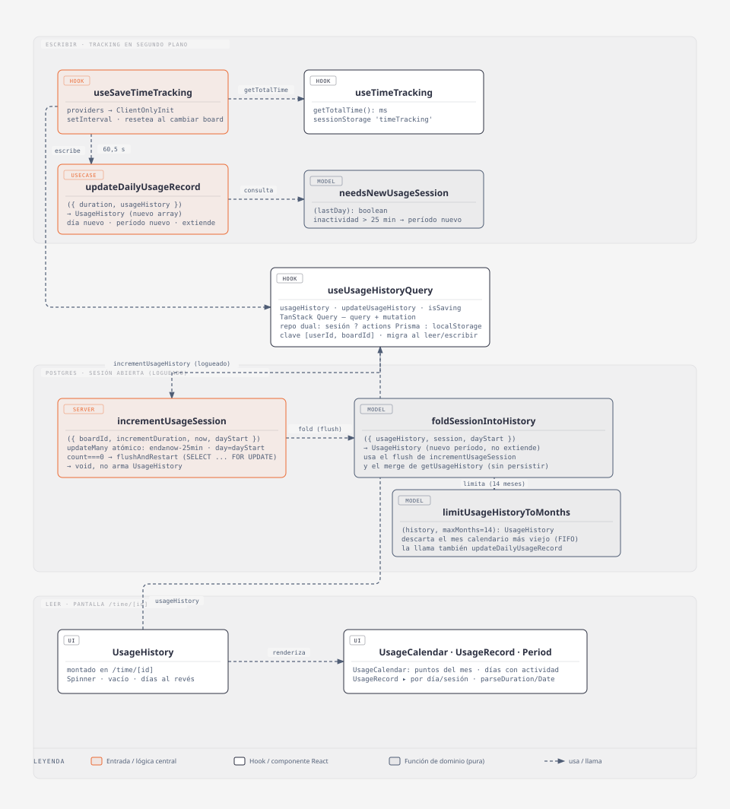
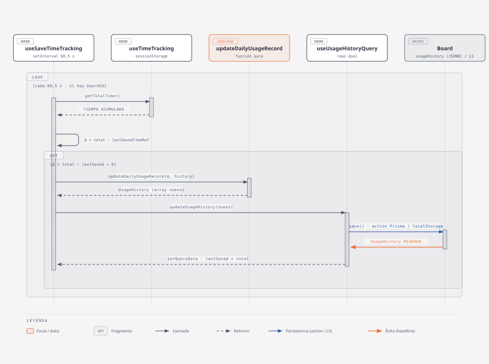

# Registro de uso

## Resumen

Mide cuánto tiempo **activo** pasa el usuario en un tablero y lo muestra en
`/time/[id]` agrupado por día y, dentro de cada día, por **sesiones** (períodos
de actividad separados por pausas largas). El conteo corre en segundo plano
mientras la app está abierta y se guarda solo, sin que el usuario haga nada. El
`Header` y el `NavRail` muestran además el cronómetro de la sesión en curso.

**Umbral de la primera vez:** una sesión no deja rastro en el `usageHistory`
hasta acumular **10 min** de tiempo activo (`MIN_DURATION_BEFORE_FIRST_SAVE`);
por debajo de eso no se guarda nada, ni por intervalo ni por flush. Evita que
una visita de "entré a mirar algo" de 1-2 min ensucie el historial con una
entrada. Una vez cruzado el umbral, el guardado sigue con la cadencia normal.

**Cada cuánto se guarda:** el registro durable (`usageHistory`) se persiste
mientras haya un tablero abierto y se haya acumulado tiempo activo desde el
último guardado (y ya se cruzó el umbral de arriba), en dos momentos:

- **por intervalo** — cada **20 min** con sesión iniciada (`UPDATE` a Postgres
  del campo `Board.usageHistory` completo, ~3/hora por tablero abierto); cada
  **60,5 s** en modo invitado (escritura a `localStorage`, sin costo de red).
- **al ver el contador** — cuando se abre el menú del `Header` o se despliega
  el `NavRail` (evento `capo:usage-flush`), para dejar el dato fresco por si el
  usuario sigue hasta `/time/[id]`.

El registro durable solo avanza su punto de referencia cuando el guardado
**confirmó** (`onSuccess` de la mutación); si falla, el próximo intento reenvía
el incremento completo en vez de perderlo.

El reloj vivo de la pestaña (`sessionStorage`, alimenta el cronómetro del
`Header`/`NavRail`) es otra cosa: se guarda cada 60 s y, además, al ocultar o
cerrar la pestaña.

- **Código:** `web-app/src/features/usage-history/` + `app/providers.tsx`
  (monta el guardado), `app/_components/{Header,NavRail}.tsx` (cronómetro en
  vivo), `app/time/[id]/TimeTracking.tsx` (pantalla).
- **Alcance:** acumular tiempo activo, cortarlo en sesiones, persistirlo por
  tablero y listarlo.
- **Fuera de alcance:** editar o borrar registros a mano, metas de tiempo,
  exportar, tiempo por tarea o por columna.

## Diagrama C4 — código

Fuentes editables: `docs/diagramas/usage-history-c4.html` (skill
`diagram-design`, tipo "UML class") y `docs/diagramas/usage-history-secuencia.html`
(tipo "sequence"). Re-exportar los `.svg` tras editar los `.html`. Fuera de los
diagramas por presupuesto: `useLastDurationPeriod` (+ `getCurrentTimeFromStorage`)
que alimenta el cronómetro en vivo del `Header`/`NavRail` leyendo `sessionStorage`
directo; los dos repositorios (`nextjsUsageHistoryRepository` /
`localStorageUsageHistoryRepository`) y las server actions detrás de
`useUsageHistoryQuery` (ver *Persistencia y modelo*).

### `useSaveTimeTracking` — `hooks/useSaveTimeTracking.tsx`

Único punto de montaje del guardado. Se instancia una sola vez en
`providers.tsx` (`ClientOnlyInit`). Con un `board_id` activo y sin un guardado
en curso, toma el incremento de tiempo desde el último guardado y lo empuja al
historial — salvo que sea el primer guardado de la sesión (`lastSavedTimeRef
=== 0`) y todavía no se hayan acumulado los 10 min de `MIN_DURATION_BEFORE_FIRST_SAVE`,
en cuyo caso corta antes sin llamar a `updateUsageHistory`. Dos disparadores
comparten la misma función `save` (y por lo tanto el mismo umbral): el
`setInterval` (20 min logueado / 60,5 s invitado) y el listener del evento
`USAGE_FLUSH_EVENT` (`capo:usage-flush`, que disparan `Header`/`NavRail` vía el
helper `requestUsageHistoryFlush` al mostrar el contador). Resetea el cronómetro
cuando cambia la sesión o el tablero, para no mezclar tiempo de un tablero en
otro (y para que el umbral de 10 min vuelva a aplicar desde cero).

### `updateDailyUsageRecord` — `useCase/updateDailyUsageRecord.ts`

El corazón de la feature: función pura que decide **dónde** cae el incremento
de tiempo (día nuevo, sesión nueva o extensión de la última sesión). No toca
red ni React; se testea sola.

### `useUsageHistoryQuery` — `hooks/useUsageHistoryQuery.tsx`

Fachada de datos con TanStack Query. Expone `usageHistory` +
`updateUsageHistory` y esconde si el origen es Postgres (sesión + tablero) o
`localStorage` (invitado). La clave de query incluye `userId` y `boardId`, así
que cambiar de tablero cambia el dato sin trabajo extra.

### `UsageCalendar` — `ui/UsageCalendar.tsx`

Calendario del **mes en curso** que `UsageHistory` monta arriba, al lado de la
card del día más reciente (`today`).
* La semana **empieza el domingo**, igual que el `DatePicker`
(`getDay()` como offset inicial). 

## Modelo / lógica

Tipos y funciones puras en `model/`; la transformación de estado en `useCase/`.

### `updateDailyUsageRecord({ duration, usageHistory }) → UsageHistory`

`useCase/`, pura, no muta el input (todo por spread). Test:
`useCase/updateDailyUsageRecord.test.ts` (Vitest, con mocks de
`needsNewUsageSession` e `isTheSameDay`). Cuatro ramas, en orden:

| Situación | Resultado |
| --- | --- |
| `usageHistory` vacío | primer día con una sesión de `duration` |
| último día ≠ hoy (`isTheSameDay` → `false`) | día nuevo con una sesión |
| mismo día y `needsNewUsageSession` → `true` | sesión nueva dentro del día de hoy |
| mismo día y `needsNewUsageSession` → `false` | extiende la última sesión: `duration += incremento`, `endTimestamp = now` |

### `needsNewUsageSession(lastDay) → boolean`

`model/`. `true` si el día no tiene períodos, o si pasaron **más de 25 min**
(`TIME_LIMIT = 1_500_000` ms) entre `lastPeriod.endTimestamp` (hora real del fin
de la última actividad) y `Date.now()`. Es lo que separa "seguí trabajando" de
"volví después de un rato". Usa `endTimestamp` y no `startTimestamp + duration`
para que el umbral sea exactamente `TIME_LIMIT`, sin depender de la cadencia de
guardado ni de las pausas cortas dentro de la sesión.

### `migrateUsageHistory(history) → UsageHistory`

`model/`. Rellena `endTimestamp` en registros viejos que no lo tienen
(`startTimestamp + duration`). Se aplica **en cada lectura y escritura** del
servidor (`get/saveUsageHistory`) y en el repo de `localStorage`.

### Acumulación del cronómetro — `hooks/useTimeTracking.tsx`

Mantiene `UserSessionTracking` en `sessionStorage` (`totalAccumulatedTime` +
`sessionStartTime`). Se auto-guarda cada 60 s y, además, en `visibilitychange`
y `beforeunload`. Opción `pauseOnTabHidden` (por defecto `true`): con la
pestaña oculta congela el conteo. **`useSaveTimeTracking` lo instancia con
`pauseOnTabHidden: false`** — el guardado de fondo sigue contando con la
pestaña en segundo plano.

- `getTotalTime()` — tiempo activo total de la sesión de pestaña en curso.
- `getCurrentTimeFromStorage()` — igual, pero leyendo `sessionStorage` sin
  hook (lo usa `useLastDurationPeriod` para el cronómetro del `Header`).
- `parseDuration(ms) → "HH:MM:SS"` — vía `new Date(ms)` en UTC.

## Persistencia y modelo

- **Tipos** (`model/usageHistory.ts`):
  - `UsageDuration = number` (milisegundos).
  - `UsageSession { startTimestamp, endTimestamp, duration }`.
  - `DailyUsage { date: number, periods: UsageSession[] }`.
  - `UsageHistory = DailyUsage[]`.
- **Prisma:** `Board.usageHistory Json @default("[]")`. **No tiene migración
  propia** — nació con el schema base (`prisma/migrations/20260828142204/migration.sql`,
  `"usageHistory" JSONB NOT NULL DEFAULT '[]'`). Las migraciones las corre el
  usuario.
- **Server actions** (`api/actions/`): `getUsageHistory({ boardId })` y
  `saveUsageHistory({ boardId, history })`. Ambas validan con
  `requireBoardAccess(boardId)` y devuelven el historial pasado por
  `migrateUsageHistory`. `saveUsageHistory` hace `prisma.board.update` del
  campo completo (no hay merge incremental server-side).
- **Cadencia de guardado:** `useSaveTimeTracking` guarda si hay `board_id`
  activo, no hay un guardado en curso (`isSaving`) y el incremento de tiempo
  desde el último guardado es `> 0`. Disparadores: `setInterval` de
  `LOGGED_IN_SAVE_INTERVAL` (**1 200 000 ms = 20 min**) con sesión o
  `GUEST_SAVE_INTERVAL` (**60 500 ms**) sin ella; y el evento `capo:usage-flush`
  (menú/rail visible). Como se instancia con `pauseOnTabHidden: false`, el reloj
  del intervalo sigue avanzando con la pestaña en segundo plano. No hay guardado
  al ocultar ni al cerrar la pestaña: lo acumulado desde el último guardado se
  pierde si la pestaña se va antes del próximo disparador (a lo sumo ~20 min
  logueado). El punto de referencia (`lastSavedTimeRef`) solo avanza en el
  `onSuccess` de la mutación, así que un guardado fallido se reintenta entero en
  el próximo disparo en vez de perderse.
- **Umbral de la primera vez:** antes de ese `incremento > 0`, `save()` corta
  si `lastSavedTimeRef.current === 0` (todavía no hubo ningún guardado
  confirmado en esta sesión de pestaña/tablero) y `getTotalTime() <
  MIN_DURATION_BEFORE_FIRST_SAVE` (**600 000 ms = 10 min**). Aplica igual a
  logueado e invitado, y a los dos disparadores (`setInterval` y
  `capo:usage-flush`). Al cruzar el umbral, el primer guardado manda el
  acumulado completo (no solo el excedente sobre 10 min).
- **Repositorio dual:** no hay archivo-fábrica; `useUsageHistoryQuery` elige
  inline. Interfaz `api/repository/usageHistoryRepository.ts` +
  `nextjsUsageHistoryRepository` (import dinámico de las actions, cuando hay
  `session` **y** `boardId`) y `localStorageUsageHistoryRepository` (clave
  `capo-usage-history`).
- **Modo invitado / `localStorage`:** todo el `UsageHistory` como JSON en
  `capo-usage-history`. `ResetBoard` (`features/boards/ui/ResetBoard.tsx`) la
  borra junto con el resto del tablero invitado.
- **`sessionStorage`:** clave `timeTracking` (`UserSessionTracking`). Efímera,
  por pestaña; no viaja al servidor. `useSaveTimeTracking` la resetea
  (`resetTimeTracking`) al cambiar de sesión o de tablero.

## i18next

- Namespace **`usage_history.*`** en `src/shared/i18n/es.json` y `en.json`:
  - `title` — "Registro de uso" / "Usage history" (título de `/time/[id]`).
  - `empty` — texto de `EmptySpaceText` cuando no hay registros.
  - `calendar_alt` — `aria-label` de la grilla de `UsageCalendar`; interpola
    `{{count}}` con los días con actividad del mes.
  - `today` — "hoy" / "today"; marca junto a la fecha en la card del día en
    curso (`UsageRecord`, condicionado por `isTheSameDay`).
- **Sin par ES/EN:** el atributo `title='Total de tiempo'` en
  `ui/UsageRecord.tsx` está hardcodeado en español (tooltip del total diario).

## Tips / historia

- **2026-09-12 — `UsageCalendar` se deformaba junto a la card de "hoy".**
  Comparten fila (`flex md:flex-row` en `UsageHistory`), y el `align-items:
  stretch` por default hacía que el calendario (alto fijo por contenido, 4 a 6
  filas de puntos) se estirara a la altura de la card de hoy cuando esta tenía
  muchos períodos, deformando la grilla. Fix: `self-start` en la `Card` de
  `UsageCalendar` para que mantenga su alto intrínseco sin importar el alto del
  sibling.
- **2026-09-12 — umbral de 10 min antes del primer guardado.** Visitas cortas
  ("entré a mirar algo" de 1-2 min) generaban una entrada en el `usageHistory`
  por cada una, sin aportar nada útil. Se agregó `MIN_DURATION_BEFORE_FIRST_SAVE`
  (10 min) como guard único dentro de `save()`, así que tanto el `setInterval`
  como `capo:usage-flush` lo respetan. Una vez cruzado el umbral, el guardado
  sigue con la cadencia normal (20 min logueado / 60,5 s invitado) — el umbral
  solo gatea el *primer* guardado de cada sesión (`lastSavedTimeRef === 0`), no
  cambia el intervalo. Antes de esto se había probado (y revertido en la misma
  tanda) bajar `LOGGED_IN_SAVE_INTERVAL` a 10 min: no resolvía el problema real,
  solo movía el número.
- **2026-09-09 — doc creada.** La feature ya existía; se documentó y se
  agregaron los dos diagramas (`diagram-design`: "UML class" + "sequence").
- **2026-09-09 — calendario del mes (`UsageCalendar`).** Se agregó un
  calendario de puntos arriba de la lista en `/time/[id]`. Tensión con
  `DESIGN.md` ("nada de streaks, medallas, contadores decorativos"): se
  resolvió del lado de la auditoría — sin números, sin racha, sin premio,
  solo puntos rellenos donde hubo actividad y solo el mes en curso. Encaja
  con el Principio 4 de producto ("el tiempo es dato"). En el C4 se metió
  dentro del nodo `UsageCalendar · UsageRecord · Period` para no rehacer el
  layout del SVG. Semana empezando el domingo + iniciales de día; las
  iniciales traducidas (`['D','L','M',…]` / `['S','M','T',…]`) se sacaron de
  `DatePicker` a `shared/lib/weekdays.ts` y ahora las comparten los dos.
  Layout final: calendario + card de hoy lado a lado; el resto de los días en
  masonry de 2 columnas en mobile (`columns-2`), un solo `flex-wrap` desde
  `sm` (`sm:contents` en los wrappers). `UsageRecord` marca la card del día en
  curso con `( hoy )` (`isTheSameDay`, clave i18n `usage_history.today`).
- **Decisión — guardado incremental en el cliente.** El cliente calcula
  `totalTime - lastSaved` y `updateDailyUsageRecord` decide la forma; el server
  action solo persiste el array entero. Mantiene la lógica en funciones puras
  testeables y el backend tonto, al precio de reescribir todo el `usageHistory`
  en cada guardado.
- **2026-09-09 — cadencia logueado a 20 min + flush oportunista.** Antes el
  intervalo era 60,5 s para todos → ~60 `UPDATE` a Postgres por hora y tablero
  abierto, sin que el dato lo justifique. Ahora: 20 min con sesión (invitado
  sigue en 60,5 s, localStorage es barato) + guardado al abrir el menú / rail
  (evento `capo:usage-flush`, suele preceder a `/time/[id]`). Se eligió 20 min
  (< `TIME_LIMIT` de 25 min) para evitar cualquier corte espurio de sesión en
  actividad continua.
- **2026-09-09 — fixes de la revisión (code-review medium).** Tres puntos:
  (1) `lastSavedTimeRef` avanzaba apenas se disparaba la mutación fire-and-forget;
  si el guardado fallaba se perdían hasta ~20 min. Ahora avanza solo en el
  `onSuccess`, con `pendingSaveTargetRef` guardando el objetivo pendiente, así
  que un fallo se reintenta entero. (2) `needsNewUsageSession` medía la
  inactividad desde `startTimestamp + duration`, que depende de la cadencia de
  guardado y de las pausas cortas ya absorbidas en la sesión; pasó a
  `lastPeriod.endTimestamp` (hora real del fin de actividad) → el umbral vuelve a
  ser exactamente `TIME_LIMIT`. (3) el flush en `visibilitychange → hidden`
  llamaba al mismo server action async sin `keepalive`/`sendBeacon`, así que no
  llegaba a completarse justo en el caso de cierre de pestaña que decía cubrir;
  se quitó (era "guardado optimista"). El flush por `capo:usage-flush`
  (menú/rail) sí funciona y se mantiene.
- **Decisión — dos relojes.** `sessionStorage` (`timeTracking`) es el reloj
  vivo de la pestaña; `usageHistory` (DB / `localStorage`) es el registro
  durable. `useLastDurationPeriod` lee el primero; `UsageHistory` el segundo.
- **Ventana de sesión = 25 min.** `TIME_LIMIT` en `needsNewUsageSession`. Ojo:
  los **nombres** de los tests de `updateDailyUsageRecord.test.ts` dicen "15
  minutos" y "1 hora" — quedaron de valores viejos, la constante es 25 min.
- **`pauseOnTabHidden` vs. `casos-de-uso.md`.** `docs/casos-de-uso.md` dice
  "el registro se pausa al cerrar la pestaña"; el guardado de fondo usa
  `pauseOnTabHidden: false`, así que **no** pausa el conteo con la pestaña
  oculta y tampoco fuerza un guardado a DB al ocultar ni al cerrar la pestaña
  (solo por intervalo o por `capo:usage-flush`). El que puede pausar el conteo
  es el hook base (`useTimeTracking`) con su default, que además sí se
  auto-guarda a `sessionStorage` en `visibilitychange`/`beforeunload`.
- **Límite conocido — `parseDuration` y las 24 h.** Formatea con
  `new Date(ms)` en UTC: a partir de 24 h el `HH` vuelve a 00. Un total diario
  no debería llegar ahí, pero no está acotado.
- **Rama muerta.** `updateDailyUsageRecord.ts` repite `usageHistory.length === 0`
  en el segundo `if` (ya cubierto por el primer `return`). Inofensivo.
- **Docs relacionados:** `docs/casos-de-uso.md` (§ Registro de uso),
  `docs/modelo-datos.md` (campo `Board.usageHistory`), `docs/arquitectura.md`
  (`ClientOnlyInit` en el montaje).
