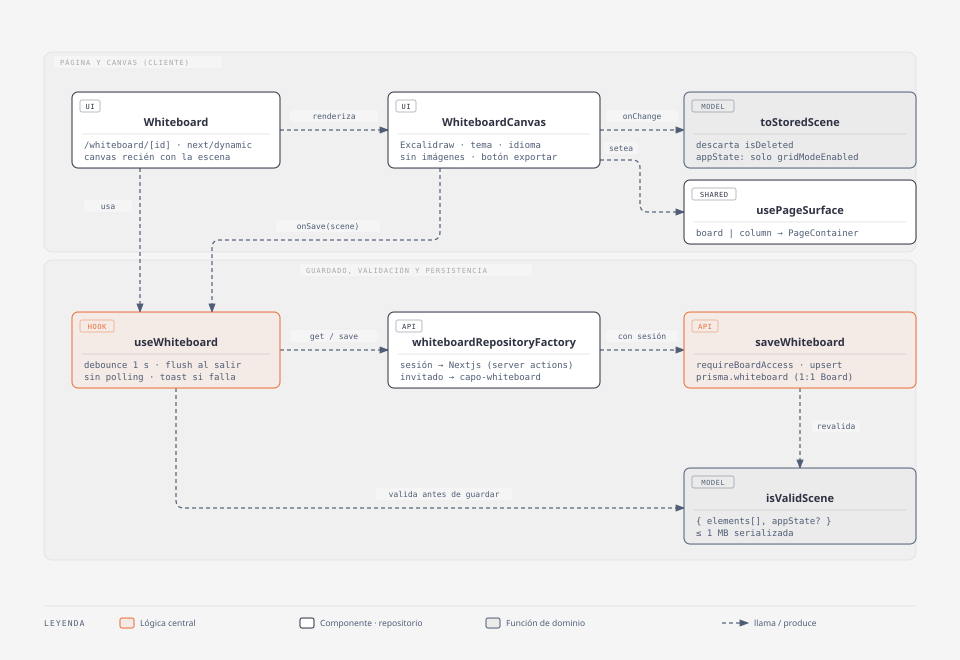

# Pizarra (Whiteboard)

## Resumen

Cada tablero tiene una pizarra de dibujo libre (Excalidraw) en `/whiteboard/[id]`,
accesible desde el menú justo después de "Tablero". Un solo editor (el dueño), un
documento por tablero, sin colaboración en vivo. Funciona con sesión (DB) y en modo
invitado (`localStorage`).

- **Código:** `web-app/src/features/whiteboard/` + `app/whiteboard/[id]/`, link en
  `app/_components/navLinks.ts`, `USER_IS_IN.WHITEBOARD`, `ShapesIcon` / `ImageDownIcon`
  en `shared/ui/atoms/icons.tsx`.
- **Alcance:** dibujar, autosave, exportar PNG/SVG. **Fuera de alcance:** colaboración en
  tiempo real, imágenes, abrir/guardar `.excalidraw`, librerías, vista para Invitados.
- **Spec:** `.scratch/whiteboard/spec.md`.

## Diagrama C4 — código

- **Whiteboard**: espera a tener la escena para montar el canvas; si lo montara antes, el
  primer `onChange` guardaría una pizarra vacía encima de la real.
- **WhiteboardCanvas**: la integración con Excalidraw (tema de `next-themes`, idioma de
  i18next, UI recortada). Solo cliente, vía `next/dynamic` + `ssr: false`.
- **useWhiteboard**: carga una vez y guarda con debounce; decide qué se manda y cuándo.
- **saveWhiteboard**: el backstop del server, valida forma y tamaño aunque el cliente ya lo
  haya hecho.

## Modelo / lógica

`src/features/whiteboard/model/whiteboard.ts` (test: `whiteboard.test.ts`):

- `WhiteboardScene = { elements: unknown[], appState?: { gridModeEnabled? } }`.
- `isValidScene(scene)`: forma `{ elements: unknown[], appState?: object }` y JSON
  serializado ≤ `MAX_SCENE_BYTES` (1 MB, medido en bytes UTF-8). Se usa en el server
  (`saveWhiteboard`, `getWhiteboard`), en el cliente antes de guardar y al leer
  `localStorage`.
- `toStoredScene(elements, appState)`: descarta elementos `isDeleted` (Excalidraw los
  conserva para undo) y deja de `appState` solo `gridModeEnabled`. No se guarda scroll,
  zoom, herramienta, selección ni fondo.

Guardado (`hooks/useWhiteboard.tsx`):

- Debounce de 1 s desde el último `onChange` + flush en `beforeunload` y al desmontar.
- `onChange` también dispara por selección, hover o zoom: se compara el JSON con el último
  guardado y si no cambió no se manda nada.
- Escena > 1 MB → toast `whiteboard.too_large_toast`, no se guarda. Error del server → toast
  `whiteboard.save_error_toast`.
- Sin polling (a diferencia de notas): un solo editor, refrescar pisaría lo que se dibuja.
  `staleTime: Infinity` + `setQueryData` al guardar, para que volver a la página muestre lo
  último.
- La query espera a que resuelva la sesión: si no, un usuario logueado arrancaría con la
  pizarra de `localStorage`.

UI de Excalidraw (`ui/WhiteboardCanvas.tsx`):

- Sin imágenes: `UIOptions.tools.image = false` (Excalidraw también rechaza pegar un archivo
  de imagen) y `onPaste` rechaza pegados de elementos que traen `files`.
- Fondo: el canvas es transparente (`viewBackgroundColor: 'transparent'`) y se ve el fondo
  del tablero que pone `PageContainer`. El selector de fondo de Excalidraw está deshabilitado.
  Un botón (`BlendIcon`, abajo a la derecha antes de exportar, md+) alterna entre el fondo del
  tablero y el de las columnas (clase `column` del tema en el wrapper). Es preferencia del
  navegador, no del tablero: `localStorage` `capo-whiteboard-background` (`'board' | 'column'`),
  también con sesión. No está en `GUEST_BOARD_KEYS`: resetear el tablero no la borra.
- "Exportar imagen": botón abajo a la derecha, junto al "?" (md+). Abre el diálogo nativo con
  `updateScene({ appState: { openDialog: { name: 'imageExport' } } })`. En mobile la barra
  inferior de Excalidraw lo taparía, así que ahí queda el menú (que solo tiene esa opción).
- Los ajustes a la UI de Excalidraw que no tienen prop viven en `ui/WhiteboardCanvas.module.css`
  (selectores `:global` sobre sus clases internas):
  - Ocultos: botón de librería, "Más herramientas" y, en md+, el menú.
  - En md+ la barra de herramientas (`.shapes-section`) sube a la fila del header
    (`translateY(-4.75rem)`). Para eso `.excalidraw` pasa a `overflow: visible` (por defecto
    recorta lo que sale de su caja). En mobile queda en su lugar: no entra junto al título.
  - En md+ el panel de propiedades del elemento (`.App-menu__left`) va a la derecha. Si el
    NavRail también está a la derecha (preferencia `useSidebarSide`), se corre `3rem` para no
    quedar debajo.
  - El texto de ayuda (`.HintViewer`, "Para mover el lienzo…") va en negro al 60 % sobre el
    fondo del tablero.
  - Paneles y botones (islas) con el color de las columnas del tema; íconos y textos con su
    `columnText`. Los colores del tema son clases de Tailwind (`bg-orange-100`…), así que
    `WhiteboardCanvas` los lee resueltos de un `` oculto con esas clases
    (`getComputedStyle`) y los pasa como `--wb-column` / `--wb-column-text` a las variables de
    Excalidraw (`--island-bg-color`, `--color-surface-low`, `--color-on-surface`).
  - Sin el anillo blanco (`box-shadow` con `--color-surface-lowest`) de zoom, deshacer, "?",
    exportar y menú. La variable no se pisa porque también es el texto de las opciones
    seleccionadas.
- `ui/excalidrawColors.css` (global) cambia el violeta de Excalidraw por el negro de la app
  (`--primary`), y el lila de "seleccionado", hover y slider por un gris translúcido. Es global
  porque los diálogos ("Exportar imagen") se renderizan en un portal fuera del wrapper, y los CSS
  modules no aceptan selectores solo globales. Solo afecta a `.excalidraw`.

## Persistencia y modelo

- **Prisma:** modelo `Whiteboard` 1:1 con `Board` (`boardId @unique`, `scene Json`,
  `updatedAt`), `onDelete: Cascade`: borrar el tablero borra la pizarra. Migración
  `prisma/migrations/20260928120000_whiteboard/` (la corre el usuario).
- **Server actions:** `api/actions/getWhiteboard.ts` / `saveWhiteboard.ts`, ambas con
  `requireBoardAccess`. `save` hace `upsert` y tira `BusinessError` si la escena no es válida.
  `get` devuelve escena vacía si lo guardado no es válido.
- **Repositorio dual:** `whiteboardRepositoryFactory(session)` → `NextjsWhiteboardRepository`
  (server actions por `import()` dinámico) o `LocalStorageWhiteboardRepository`
  (clave `capo-whiteboard`, test en `LocalStorageWhiteboardRepository.test.ts`).
- **Modo invitado:** `capo-whiteboard` está en `GUEST_BOARD_KEYS` de `ResetBoard`.
- **Invitados de tablero compartido:** no ven la pizarra; `getSharedBoard` no la incluye.
- **Tiempo de uso:** cuenta solo, `useSaveTimeTracking` mide mientras hay `boardId` y la
  página lo sincroniza con `useSyncBoardIdFromRoute`.

## i18next

- `menu.whiteboard`: "Pizarra" / "Whiteboard".
- `whiteboard.export_image`, `whiteboard.toggle_background`, `whiteboard.too_large_toast`, `whiteboard.save_error_toast`.
- Archivos: `src/shared/i18n/es.json` y `en.json`.
- Los textos de Excalidraw usan su propio i18n: `langCode` `es-ES` o `en` según
  `i18n.language`.

## Tips / historia

- 2026-09-28 — Se eligió `@excalidraw/excalidraw` (MIT). Se descartó **dgmjs**: es GPLv3 y
  `@dgmjs/core` depende de tiptap v2 (Capo usa v3).
- 2026-09-28 — El fondo pasó de ser configurable (`viewBackgroundColor` persistido) a ser el
  del tablero: canvas transparente y el color no se guarda.
- 2026-09-28 — El export se sacó del menú hamburguesa a un botón propio: Excalidraw no deja
  agregar botones a su barra de herramientas. Se renderiza como `children` de `<Excalidraw>`
  (queda dentro de su capa de UI) y reusa la clase `help-icon` para verse igual que el "?".
- Límite conocido: el recorte de la UI de Excalidraw (librería, "Más herramientas", menú,
  barra en el header, margen del panel) depende de sus clases CSS internas. Al actualizar
  `@excalidraw/excalidraw`, revisar que sigan existiendo.
- Límite conocido: el flush de `beforeunload` con sesión es best-effort (la server action
  puede no terminar si la pestaña se cierra). En invitado es síncrono.
- Límite conocido: las escenas > 1 MB no se guardan. Sin imágenes es difícil llegar, pero un
  dibujo a mano alzada muy denso podría.
- e2e: `e2e/whiteboard.spec.ts` (dibujar un rectángulo → recargar → sigue ahí). La primera
  compilación de Excalidraw en `next dev` es lenta, por eso el `test.slow()` y los timeouts
  largos; en CI (build de producción) no hacen falta.
