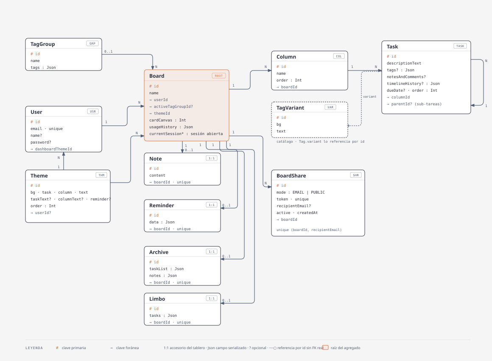

# Modelo de datos

Esquema Prisma (`web-app/prisma/schema.prisma`), provider `postgresql`.

- **`Board`** es la raíz del agregado: todo cuelga de un tablero y se borra en
  cascada con él.
- **`Note`**, **`Reminder`**, **`Archive`** y **`Limbo`** son accesorios 1:1
  del tablero (`boardId` único).
- **`TagGroup`** es compartible: muchos tableros pueden tener el mismo grupo
  como activo (`activeTagGroupId`). Además, cada tablero puede tener a lo
  sumo un `TagGroup` propio (`boardId` único, relación `BoardCustomTags`) con
  las etiquetas que crea su dueño; se borra en cascada con el tablero.
- **`TagVariant`** es un catálogo de paletas de color para tags (`id`, `bg`,
  `text`), seeded desde `prisma/seed.ts`. Sin FK real: se referencia por `id`
  dentro del Json de `TagGroup.tags` / `Task.tags`.
- **`Task.parentId`** es una auto-relación opcional (`TaskChildren`) para
  sub-tareas; se borra en cascada con el padre.
- **`Theme`** es el catálogo de temas de color, seeded desde `prisma/seed.ts`
  (`upsert` por `id`). `userId` nullable: `null` = tema integrado, seteado =
  tema del usuario (a futuro). Lo referencian `Board.themeId` y
  `User.dashboardThemeId` (FK, default `"retro"`) — cada tablero tiene su tema y
  el dashboard el suyo.
- **`Board.cardCanvas`** (`Int`) es el índice del patrón de fondo de la card en
  el dashboard; se asigna al azar al crear el tablero y se puede cambiar.
- Campos `Json` (`tags`, `timelineHistory`, `usageHistory`, `taskList`, …)
  guardan estructuras que no necesitan consultarse por separado.
- **`Board.currentSession{Start,End,Duration,Day}`** (`BigInt?`/`Int?`, los 4 juntos: los 4 `null` o los 4 con valor) son la sesión de uso **abierta** del tablero — separada de `usageHistory` a propósito, para poder incrementarla de forma atómica (`{ increment }` de Prisma) sin reescribir el JSON en cada guardado. Se vuelca a `usageHistory` recién al cerrar (gap de actividad o cambio de día). Detalle en [`docs/features/usage-history.md`](./features/usage-history.md).
- **`BoardShare`** son los links para que un Invitado vea el tablero en solo
  lectura: hasta 4 filas `EMAIL` (`recipientEmail`) + 1 `PUBLIC` por tablero,
  `token` único, `active` on/off. Se borra en cascada con el tablero. Detalle en
  [`docs/features/compartir-tableros.md`](./features/compartir-tableros.md)
  (no dibujado en el diagrama todavía).
- **`Task.dueDate`** (`String?`, `YYYY-MM-DD` sin hora) es la fecha límite
  opcional de la tarea; se setea solo al crearla.
- `Account`, `Session` y `Verification` son las tablas que pide el
  `prismaAdapter` de Better Auth (no se dibujan).

El modo invitado replica estas mismas formas en `localStorage`, una clave por
feature. Excepción: el tema es uno solo y global (`capo-theme`), no hay tema por
tablero ni catálogo para invitados.

---

## Cómo se llega a estos datos

El acceso siempre pasa por una server action que valida sesión y pertenencia
antes de tocar la base — ver [arquitectura.md](./arquitectura.md) (§2
Contenedores y §3 Componentes) para el patrón de repositorio dual y las
guardas de `serverAuth.ts`.

## Regenerar el diagrama

Fuente: `docs/diagramas/modelo-datos.html`, hecho con la skill `diagram-design`.
El `.svg` embebido es su bloque `<svg>` con el `@import` de fuentes inyectado.
Tras editar el `.html`, volver a exportar el `.svg`.
