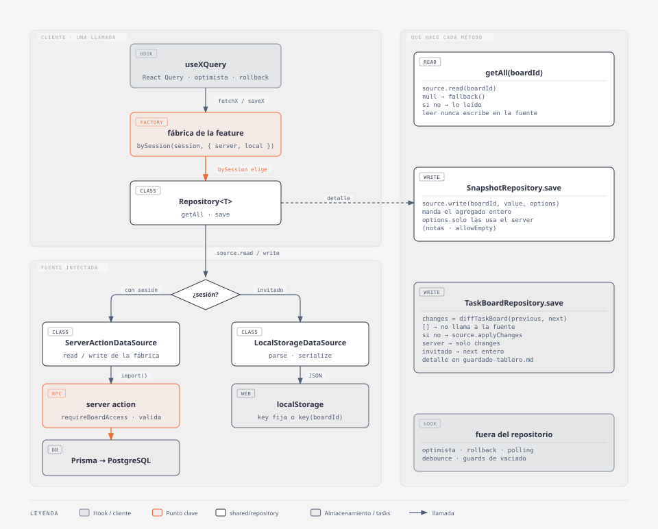

# Repositorios y fuentes de datos

Todo lo que una feature guarda por tablero (tareas, archivo, limbo, notas, notas
archivadas, recordatorios, pizarra) se lee y se escribe a través de un
repositorio de `web-app/src/shared/repository/`. El módulo reparte el
trabajo en tres piezas.

1. **Qué se guarda y cuándo.** Lo decide el repositorio (`Repository<T>` y sus
   subclases), que no sabe dónde terminan los datos.
2. **Dónde se guarda.** Lo decide la fuente (`LocalStorageDataSource` para
   invitados, `ServerActionDataSource` con sesión), que no sabe nada del dominio.
3. **Cuál de las dos fuentes se usa.** Lo decide `bySession`, en la fábrica de
   cada feature, una sola vez por llamada.

## Arquitectura


<sub>Fuente editable: [`diagramas/repositorios-c4.html`](diagramas/repositorios-c4.html)</sub>

### Módulo `shared/repository/`

| Archivo | Exporta | Responsabilidad |
|---|---|---|
| `dataSource.ts` | `ReadSource<T>`, `SnapshotSource<T, O>` | Contratos de las fuentes. |
| `repository.ts` | `Repository<T>`, `SnapshotRepository<T, O>` | Lectura con fallback y guardado del agregado entero. |
| `localStorageDataSource.ts` | `LocalStorageDataSource<T>` | Fuente de invitado, JSON en `localStorage`. |
| `serverActionDataSource.ts` | `ServerActionDataSource<T, O>` | Fuente con sesión, delega en server actions que inyecta la feature. |
| `bySession.ts` | `bySession` | Elige la fuente según haya sesión. |
| `index.ts` | todo lo anterior | Única API pública del módulo. |

### Contratos

```ts
interface ReadSource<T> {
	read(boardId: string): Promise<T | null>
}

interface SnapshotSource<T, O = void> extends ReadSource<T> {
	write(boardId: string, value: T, options?: O): Promise<void>
}
```

`read` devuelve `null` cuando no hay nada guardado o lo guardado no sirve. Nunca
devuelve un valor por defecto, porque decidir el valor por defecto es trabajo del
repositorio.

`O` son opciones por llamada que viajan de `save` a `write` sin que el
repositorio las mire. Hoy solo las usa notas (`{ allowEmpty?: boolean }`).

### Repositorios

| Clase | Lectura | Escritura | Quién la usa |
|---|---|---|---|
| `Repository<T>` | `getAll(boardId)` = `source.read(boardId) ?? fallback()` | no tiene | base de las otras dos |
| `SnapshotRepository<T, O>` | heredada | `save(value, boardId, options?)` = `source.write(...)` | archivo, limbo, notas, notas archivadas, recordatorios, pizarra |
| `TaskBoardRepository` (en `features/tasks`) | heredada | `save(next, boardId, previous)` calcula el diff y llama a `source.applyChanges` | tablero de tareas |

`fallback` es una función y no un valor para que cada feature decida si
devuelve una constante (`defaultScene`, `emptyTaskBoard`) o un valor nuevo
(`() => []`).

### Fuentes

**`LocalStorageDataSource<T>`** recibe un objeto de configuración.

| Opción | Tipo | Para qué sirve |
|---|---|---|
| `key` | `string \| (boardId) => string` | Con un string guarda un solo valor para todos los boards; con una función guarda uno por board. |
| `parse` | `(raw: unknown) => T \| null` | Valida lo leído. Si devuelve `null`, el repositorio usa el fallback. |
| `serialize` | `(value: T) => unknown` | Transforma el valor antes del `JSON.stringify`. |

Si la clave no existe o el JSON está roto, `read` devuelve `null` sin tirar ni
borrar la clave. `write` ignora `options`, porque los guards que dependen de
ellas solo tienen sentido contra el server.

**`ServerActionDataSource<T, O>`** recibe `read` y `write` ya armados. Normaliza
`undefined` a `null` en la lectura y pasa `options` tal cual en la escritura. La
clase no importa ninguna action: la fábrica de la feature las importa con
`await import('../actions/<archivo>')` dentro de cada función, así el bundle del
invitado no arrastra código de server actions hasta que hay sesión.

### Fábricas por feature

Cada feature tiene un archivo en `features/<feature>/api/repository/` que arma
sus dos fuentes y el repositorio.

```ts
const local = () => new LocalStorageDataSource<Limbo>({ key: (boardId) => `limbo-${boardId}` })

const server = () =>
	new ServerActionDataSource<Limbo>({
		read: async (boardId) => (await import('../actions/getLimbo')).getLimbo({ boardId }),
		write: async (boardId, tasks) => {
			const { saveLimbo } = await import('../actions/saveLimbo')
			await saveLimbo({ boardId, tasks })
		},
	})

const getLimboRepository = (session: SessionType) =>
	new SnapshotRepository(bySession(session, { server, local }), (): Limbo => [])
```

`local` y `server` son funciones para que `bySession` construya solo la fuente
que va a usar.

| Feature | Archivo | Repositorio | Clave de `localStorage` | `parse` / `serialize` | Fallback |
|---|---|---|---|---|---|
| tareas | `tasks/api/repository/index.ts` | `TaskBoardRepository` | `taskListInEachColumn` | — | `emptyTaskBoard` |
| archivo | `archived-tasks/api/repository/index.ts` | `SnapshotRepository` | `tasks-archive` | — | `[]` |
| limbo | `limbo/api/repository/index.ts` | `SnapshotRepository` | `limbo-<boardId>` | — | `[]` |
| notas | `notes/api/repository/notesRepositoryFactory.ts` | `SnapshotRepository<Notes, { allowEmpty }>` | `capo-notes` | envuelve en `{ notes }` y valida que sea string | `defaultNotes` |
| notas archivadas | `notes/api/repository/libraryOfArchivedNotesRepositoryFactory.ts` | `SnapshotRepository` | `capo-archived-notes` | — | `defaultLibraryOfArchivedNotes` |
| recordatorios | `reminders/api/repository/ReminderRepositoryFactory.ts` | `SnapshotRepository` | `capo-reminder` | — | `blankReminder` |
| pizarra | `whiteboard/api/repository/whiteboardRepositoryFactory.ts` | `SnapshotRepository` | `capo-whiteboard` | `parse` con `isValidScene` | `defaultScene` |

Las fábricas exportan funciones `fetchX(session, boardId)` / `saveX({ ... })`
que usan los hooks. La pizarra es la excepción porque su hook usa
`whiteboardRepositoryFactory(session)` directamente.

## Funcionamiento



<sub>Fuente editable: [`diagramas/repositorios-flujo.html`](diagramas/repositorios-flujo.html)</sub>

### 1. El repositorio no conoce la fuente

`Repository` recibe la fuente por constructor. No hay un `if (session)` dentro
de ningún repositorio: la decisión se toma una vez en `bySession` y el
repositorio trabaja igual con cualquier objeto que cumpla el contrato. Por eso
los tests del repositorio usan una fuente en memoria y no necesitan
`localStorage` ni mocks de server actions.

### 2. Lectura con fallback

`getAll` pide a la fuente y, si recibe `null`, devuelve `fallback()`. Leer nunca
escribe: un invitado sin datos ve el valor por defecto, pero `localStorage` sigue
vacío hasta el primer `save`.

### 3. Guardado por snapshot

`SnapshotRepository.save` manda el agregado entero en cada llamada. Sirve para
las features donde el agregado es chico o se reemplaza completo de todas formas
(un string de notas, una lista de recordatorios, una escena de pizarra). Del
lado del server, las actions hacen un `upsert` por `boardId`.

### 4. Guardado por diff (tablero de tareas)

El tablero es el agregado más grande y el que más se edita, así que no se
guarda entero. `TaskBoardRepository` extiende `Repository<TaskBoard>` pero no
`SnapshotRepository`, porque su `save` necesita también el tablero anterior.

```ts
async save(next: TaskBoard, boardId: string, previous: TaskBoard): Promise<void> {
	const changes = diffTaskBoard(previous, next)
	if (!changes.length) return
	await this.source.applyChanges(boardId, changes, next)
}
```

Su fuente tiene otro contrato, `TaskBoardSource`, con `applyChanges` en lugar
de `write`.

| Fuente | Qué hace con `changes` | Qué hace con `next` |
|---|---|---|
| `ServerTaskBoardSource` | Los manda a `applyTaskBoardChanges`, que los aplica en una transacción. | Lo ignora. |
| `SnapshotTaskBoardSource` | Los ignora. | Lo escribe entero con un `SnapshotSource<TaskBoard>` (un `LocalStorageDataSource`). |

`SnapshotTaskBoardSource` es un adaptador: convierte cualquier
`SnapshotSource<TaskBoard>` en un `TaskBoardSource`. En `localStorage` escribir
el tablero entero es barato y evita reimplementar el diff contra JSON.

El detalle del diff, la server action y la concurrencia está en
[`guardado-tablero.md`](guardado-tablero.md).

### 5. Opciones por llamada

Notas necesita decirle al server que un vaciado fue confirmado por el usuario.
El parámetro `O` lo resuelve sin que el repositorio genérico sepa qué es
`allowEmpty`.

```ts
await notesRepositoryFactory(session).save(notes, boardId, { allowEmpty })
// SnapshotRepository.save → source.write(boardId, notes, { allowEmpty })
// ServerActionDataSource.write → saveNotes({ boardId, notes, allowEmpty })
```

`LocalStorageDataSource` ignora las opciones. Para el invitado alcanza con el
guard del hook (`useNotesQuery`), y el server repite la validación porque es el
único guard que el cliente no puede saltear.

### 6. Dónde vive la lógica que no es de persistencia

El repositorio no hace updates optimistas, rollback, debounce ni guards de
"estás por borrar todo". Todo eso vive en los hooks.

| Responsabilidad | Dónde |
|---|---|
| Cache, update optimista, rollback, polling | hook de React Query de cada feature |
| Guardados en serie del tablero | `useTaskBoardQuery` (`scope` de `useMutation`) |
| Debounce y flush en `beforeunload` | `useWhiteboard` |
| Guard de vaciado (notas, tablero) | hook en el cliente y server action en el server |
| Autorización (`requireBoardAccess`) y validación de forma | server action |

## Decisiones de diseño

| Decisión | Motivo |
|---|---|
| Un `Repository<T>` genérico en lugar de un par `LocalStorageXRepository` / `NextjsXRepository` por feature | El `getItem` / `JSON.parse` / `import()` vive en un solo lugar, y una feature nueva escribe solo su configuración. |
| La fuente se inyecta, no se elige adentro | El repositorio se testea con una fuente en memoria y la regla "con sesión va al server" está en un solo lugar (`bySession`). |
| `read` devuelve `null` y el repositorio pone el fallback | La fuente no conoce el dominio, así que no puede saber cuál es el valor vacío de cada feature. |
| `parse` devuelve `null` en vez de tirar | Un `localStorage` corrupto o de una versión vieja no rompe la app; el invitado ve el valor por defecto. |
| `TaskBoardRepository` no hereda de `SnapshotRepository` | Su `save` tiene otra firma (necesita `previous`) y otra fuente (`applyChanges`). Heredar el `save` de snapshot dejaría un método que no se debe usar. |
| `SnapshotTaskBoardSource` en lugar de un diff para `localStorage` | En el navegador reescribir el tablero entero cuesta poco, y el diff solo hace falta para no pisar cambios de otras pestañas, PCs o personas en el server. |
| Import dinámico de las actions dentro de la fábrica | El invitado no descarga el código de las actions, y la clase `ServerActionDataSource` no depende de ninguna feature. |
| Los repositorios se crean en cada llamada | No tienen estado. Crear uno es construir dos objetos chicos, y así siempre usan la sesión actual. |

## Cómo sumar una feature nueva

1. Definir el tipo del agregado y su valor por defecto en `model/`.
2. Escribir las server actions `getX({ boardId })` y `saveX({ boardId, ... })`
   en `api/actions/`, con `requireBoardAccess` y la validación de lo que manda
   el cliente.
3. En `api/repository/`, armar `local` con `LocalStorageDataSource` (agregar
   `parse` si lo guardado puede venir de una versión vieja o ser inválido) y
   `server` con `ServerActionDataSource` importando las actions con `import()`.
4. Construir un `SnapshotRepository` con `bySession(session, { server, local })`
   y el fallback.
5. Exportar `fetchX` / `saveX` y consumirlas desde un hook de React Query. La
   UI nunca llama al repositorio directamente.
6. Si el agregado es grande y se edita seguido, revisar
   [Cuándo una feature sale del patrón](#cuándo-una-feature-sale-del-patrón)
   antes de quedarse con el snapshot.

## Cuándo una feature sale del patrón

Toda feature empieza con `SnapshotRepository`, que en cada `save` manda todos sus datos juntos. Una feature deja de usarlo cuando mandar todo junto trae problemas, por ejemplo cuando son muchos datos o cuando la feature tiene modo colaborativo y varias personas editan lo mismo a la vez. Salir del patrón no significa reescribir todo. El tablero de tareas, por ejemplo, cambia solo la forma de guardar (manda lo que cambió en lugar de todo). Para leer sigue usando `getAll` de `Repository`, para elegir la fuente sigue usando `bySession` y el invitado sigue guardando en `localStorage` con `LocalStorageDataSource`.

La tabla ordena los cuatro niveles posibles, del que usa todo el módulo al que
no usa nada.

| Nivel | Qué cambia | Ejemplo |
|---|---|---|
| 1. Snapshot con configuración | Nada del módulo. La feature solo elige `key`, `parse`, `serialize` y el fallback. | archivo, limbo, recordatorios, pizarra |
| 2. Snapshot con opciones | El `save` lleva opciones por llamada (`O`) que la action del server interpreta. | notas (`allowEmpty`) |
| 3. Repositorio propio | La feature extiende `Repository<T>`, define su propio `save` y su propio contrato de fuente. | tablero de tareas |
| 4. Sin repositorio | Los hooks llaman a las server actions sin capa `repository`. | `dashboard` |

### Señales para pasar al nivel 3

Alcanza con una para considerarlo, y con dos casi siempre conviene.

- **El agregado es grande y se edita seguido.** Cada `save` del tablero
  reescribiría todas las columnas y tareas por mover una sola tarjeta.
- **Modo colaborativo, o varias pestañas o PCs editando a la vez.** Con un
  snapshot, el último guardado pisa lo que otra persona o pestaña creó y todavía
  no le llegó. Con un diff, cada una manda solo lo que cambió ella. Hoy compartir
  un tablero es de solo lectura, así que en el tablero el caso real son las
  pestañas y PCs de un mismo usuario. Si se habilita la edición compartida, esta
  señal pasa a ser la principal.
- **En la DB el agregado son varias tablas.** El tablero son filas de `Column` y
  de `Task` con orden y relación padre/hija. Un snapshot obligaría a borrar y
  recrear todo, o a calcular el diff del lado del server sin saber qué tenía el
  cliente.
- **El server necesita validar cada cambio.** `applyTaskBoardChanges` revisa que
  cada id pertenezca al board y aplica los cambios en fases dentro de una
  transacción. Eso solo es posible si recibe cambios y no un valor final.

### Señales que no alcanzan

Estas situaciones se resuelven sin salir del nivel 1 o 2.

- **Hace falta un guard antes de guardar** (no vaciar notas, no dejar el tablero
  en cero). Va en el hook y en la action, como `allowEmpty`.
- **Hay que agrupar guardados** (debounce de la pizarra, guardados en serie).
  Es trabajo del hook.
- **Lo guardado en `localStorage` puede venir roto o de otra versión.** Se
  resuelve con `parse`.
- **La action del server recibe otros nombres de parámetros.** La fábrica los
  adapta dentro de `write`, como hace recordatorios con `reminders`.

### Cómo sale `TaskBoard`

El tablero es el único caso de nivel 3 y sirve de plantilla. Sale del patrón
solo en la escritura y reusa todo lo demás.

| Pieza | ¿Se reusa? | Cómo |
|---|---|---|
| Lectura con fallback | sí | `TaskBoardRepository` extiende `Repository<TaskBoard>`, así que `getAll` es el mismo. |
| Elección de fuente | sí | La fábrica sigue usando `bySession(session, { server, local })`. |
| Fuente de invitado | sí | `SnapshotTaskBoardSource` envuelve un `LocalStorageDataSource<TaskBoard>` y escribe el snapshot. |
| `save` | no | Su firma es `save(next, boardId, previous)` y calcula `diffTaskBoard`. |
| Contrato de fuente | no | `TaskBoardSource` reemplaza `write` por `applyChanges(boardId, changes, next)`. |
| Fuente con sesión | no | `ServerTaskBoardSource` es una clase propia en lugar de un `ServerActionDataSource`. |
| Server action | no | `applyTaskBoardChanges` valida y aplica cambios, no un `upsert` del agregado. |

Para una feature que siga el mismo camino, las reglas son estas.

1. **Seguir extendiendo `Repository<T>`.** La lectura casi nunca necesita
   cambiar, y así `getAll` y el fallback quedan iguales al resto.
2. **No heredar de `SnapshotRepository`.** Si el `save` tiene otra firma,
   heredarlo deja disponible un método que no se debe llamar.
3. **Definir el contrato de fuente en la feature**, extendiendo `ReadSource<T>`,
   y no agregarlo a `shared/repository` mientras lo use una sola feature.
4. **Mantener `bySession` en la fábrica.** Salir del patrón no habilita
   preguntar por la sesión dentro del repositorio.
5. **Dejar al invitado en snapshot** con un adaptador sobre `SnapshotSource`,
   salvo que `localStorage` también sufra el problema que motivó la salida.
6. **El diff es una función pura en `model/`** (`diffTaskBoard`), testeable sin
   repositorio ni fuente.
7. **Documentarlo** en el doc de la feature y en un doc técnico propio si el
   flujo lo amerita, como [`guardado-tablero.md`](guardado-tablero.md).

### Nivel 4, sin repositorio

`dashboard` no tiene capa `repository` porque solo existe con sesión. Lista,
crea y borra tableros del usuario, y no tiene modo invitado que guardar en
`localStorage`. Una feature puede quedarse ahí solo si cumple lo mismo, es
decir, si nunca va a funcionar sin backend. Si algún día necesita modo
invitado, entra al nivel 1.

`boards`, `tags`, tags personalizados y `usage-history` también están fuera del
módulo, pero no por una decisión de este tipo. Tienen modo invitado y entran en
el nivel 1 o 2. En `usage-history`, `migrateUsageHistory` encaja como `parse`;
lo único a resolver es que su `save` hoy devuelve el historial guardado.

## Reglas para quien toque un repositorio

1. No preguntar por la sesión dentro de un repositorio ni de una fuente. Eso es
   trabajo de `bySession`.
2. No poner valores por defecto en las fuentes. `read` devuelve `null` y el
   fallback lo decide la fábrica.
3. No importar server actions con `import` estático desde `api/repository/`.
4. Lo que el server tiene que garantizar (acceso, forma del payload, no vaciar
   sin confirmar) se valida en la action, aunque el hook ya lo valide.
5. Las opciones de `save` son para el server. Si el invitado necesita el mismo
   comportamiento, va en el hook.

## Limitaciones conocidas

- **No todas las features usan el módulo.** `boards`, `tags`, tags
  personalizados y `usage-history` usan su propia interfaz, clases
  `LocalStorage*Repository` / `Nextjs*Repository` y un `if (session)` en su
  fábrica.
- **Claves fijas en `localStorage`.** Salvo el limbo, las claves no incluyen el
  `boardId`. Funciona porque el invitado tiene un solo tablero; si eso cambia,
  hay que pasar `key` como función y migrar las claves existentes.
- **Sin validación por defecto en `localStorage`.** Sin `parse`, lo leído se
  castea a `T` sin chequear. Solo la pizarra y las notas validan.
- **Fallbacks compartidos.** `emptyTaskBoard` y `defaultScene` son constantes
  que el repositorio devuelve tal cual; si alguien las muta en lugar de copiar,
  el cambio se filtra a las lecturas siguientes.
- **Sin manejo de cuota.** `localStorage.setItem` puede tirar
  `QuotaExceededError` y la fuente no lo atrapa; el error llega al hook.
- **Sin atomicidad entre features.** Archivar una tarea (`useArchiveTask`) son
  dos guardados independientes, uno del archivo y otro del tablero. Si uno
  falla y el otro no, la tarea queda en los dos lugares o en ninguno.

## Tests

| Archivo | Qué garantiza |
|---|---|
| `shared/repository/repository.test.ts` | `getAll` devuelve lo de la fuente o el fallback; `save` escribe en la fuente inyectada y pasa las opciones. Usa una fuente en memoria. |
| `shared/repository/localStorageDataSource.test.ts` | Clave vacía o JSON corrupto dan `null`; clave fija vs. clave por board; `serialize` y `parse` envuelven y validan. |
| `shared/repository/bySession.test.ts` | Sin sesión elige `local`, con sesión elige `server`. |
| `features/tasks/api/repository/taskBoardRepository.test.ts` | Sin cambios no llama a la fuente; con cambios pasa solo el diff; `SnapshotTaskBoardSource` guarda y relee el tablero entero. |

`ServerActionDataSource` no tiene test propio porque solo delega; las server
actions tienen los suyos en cada feature.
